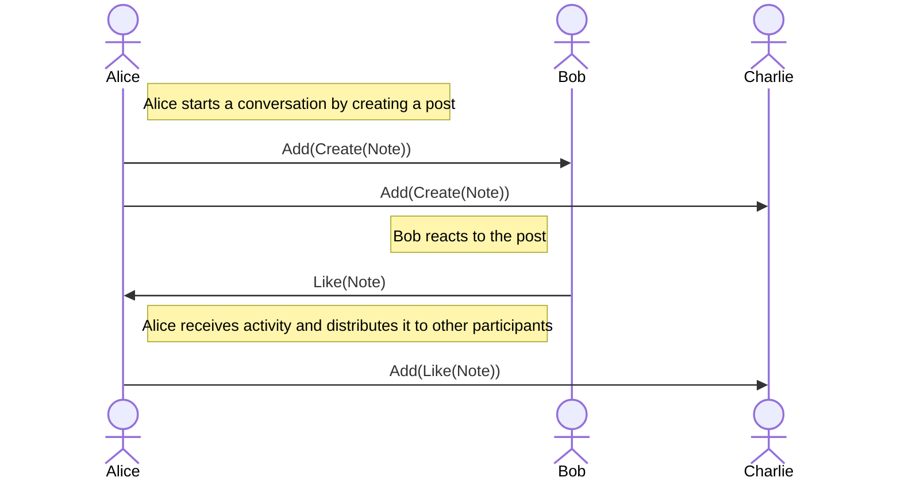

# FEP-171b: Conversation Containers

## Summary

This document specifies a model for managing conversations in [ActivityPub] network. It is based on the implementation of [Conversation Containers][Containers] in [Streams](https://codeberg.org/streams/streams).

In this model conversations are represented as collections controlled by a single actor. Such conversations take place within a specific audience and may be moderated.

## Requirements

The key words "MUST", "MUST NOT", "REQUIRED", "SHALL", "SHALL NOT", "SHOULD", "SHOULD NOT", "RECOMMENDED", "MAY", and "OPTIONAL" in this document are to be interpreted as described in [RFC-2119].

## Containers

A conversation container is implemented as a collection. Every item in that collection is an `Add` activity where `object` is another activity (such as `Create`, `Update`, `Delete`, `Like`, `Dislike`, `EmojiReact` or `Announce`). The conversation owner distributes `Add` activities to other participants, thus keeping their views of the conversation synchronized.



### Container collection

- Collection type MUST be `OrderedCollection`.
- Collection items MUST be in chronological order.
- Collection MUST have an `attributedTo` property containing the `id` of the conversation owner.
- Collection SHOULD have `collectionOf` property with value `Activity`.

The audience of a conversation SHOULD be able to access the container collection. If a server forwards activities without storing them, it is permitted to not publish the collection. However, that would limit the ability of other servers to backfill conversations.

Actors who are not part of the audience MUST be denied access to the collection.

>[!NOTE]
>The required collection type might be changed to a more descriptive one (such as `ConversationContainer`) in a future version of this document. That will allow identification of `Add` activities belonging to a conversation container by the value of `Add.target.type`.

>[!NOTE]
>In addition to the conversation container collection, implementers MAY provide collection that represents the conversation tree and contains posts.

### Adding activities to a conversation

Conversation owner can add any activity to the conversation. However, if a `context` property is present on the activity, its value SHOULD be identical to the ID of a conversation container.

When activity is added to the conversation, its owner sends an `Add` activity to the conversation audience (usually defined by a top-level post).

`Add` activities published by the conversation owner MUST have a `target` property containing a partial object:

- `type`: `OrderedCollection`
- `id`: the `id` of the conversation container.
- `attributedTo`: the `id` of the collection owner.

`Add` activities published by the conversation owner MUST be added to the conversation container collection.

>[!NOTE]
>The "conversation outbox" model where the `target` of `Add` activity is a collection of `Add` activities is not compatible with ActivityStreams definition of [Add](https://www.w3.org/TR/activitystreams-vocabulary/#dfn-add) activity, according to which *Add activity indicates that the actor has added the object to the target*.

### Top-level post

The author of a top-level post it not necessarily the conversation owner. When owner is a group, conversations can be started by any of its members.

The top-level post MUST have a `contextHistory` property that refers to the conversation container. The presence of this property indicates that publisher implements conversation containers.

>[!NOTE]
>In addtion to `contextHistory` property, implementers MAY add a `context` property that refers to a collection of posts.

### Interactions

Regardless of their audience, all activities in a conversation SHOULD only be delivered to the conversation owner.

Conversation participants SHOULD reject conversation activities that have not been added to the conversation by its owner.

The audience of a reply MUST be copied from a conversation root.

Reply with a different audience can be created by starting a new conversation and including a [FEP-e232] link to the post instead of specifying it in `inReplyTo`.

### Moderation

When conversation owner does not want to add activity to a conversation, that activity is ignored and a corresponding `Add` activity is not published.

To remove a previously approved post from a conversation, its owner publishes a `Delete` activity where `object` is the post that must be removed. This activity is then wrapped in `Add` activity and distributed to the conversation audience.

>[!NOTE]
>Actor shouldn't be able to delete objects it didn't create. In a future version of this document `Delete` might be replaced with `Remove(target: Thread)`.

### Backfilling

Conversation participants can retrieve missing activities by reading the conversation container collection.

## Authentication

When an ActivityPub server receives an `Add` activity in its inbox, it MUST perform the authentication procedure according to [FEP-fe34]:

- If `Add.object` is not embedded, fetch it. If location of the fetched activity has the same origin as `Add.object`, add it to the conversation.
- If `Add.object` is embedded, check whether `Add.actor` and `Add.object.actor` have the same origin.
- If origins are equal, add `Add.object` to the conversation.
- If origins are different and [FEP-8b32] integrity proof is present, verify the proof. If the proof is valid, add `Add.object` to the conversation.
- If integrity proof is not present, fetch `Add.object` by its `id`. If location of the fetched activity has the same origin as `Add.object.id`, add fetched activity to the conversation.

The processing of unauthenticated embedded activities is strongly discouraged. If such activities are not rejected by the consumer, a malicious conversation owner may be able to perform a [cache poisoning](https://en.wikipedia.org/wiki/Cache_poisoning) attack and overwrite any actor or a post in consumer's local cache by sending a forged `Update(Actor)` or `Update(Object)` wrapped in an `Add` activity.

>[!WARNING]
>Sometimes activities have non-dereferenceable identifiers. That may prevent their authentication.

## Examples

Example of an `Add` activity for a reply to a followers-only post:

```json
{
  "@context": [
    "https://www.w3.org/ns/activitystreams"
  ],
  "type": "Add",
  "id": "https://alice.example/activities/add/1",
  "actor": "https://alice.example/actors/1",
  "object": {
    "@context": [
      "https://www.w3.org/ns/activitystreams"
    ],
    "type": "Create",
    "id": "https://bob.example/activities/create/1",
    "actor": "https://bob.example/actors/1",
    "context": "https://alice.example/contexts/1",
    "contextHistory": "https://alice.example/contexts/1/history",
    "object": {
      "@context": [
        "https://www.w3.org/ns/activitystreams"
      ],
      "type": "Note",
      "id": "https://bob.example/posts/1",
      "inReplyTo": "https://alice.example/posts/1",
      "content": "This is a reply",
      "to": [
        "https://alice.example/actors/1",
        "https://alice.example/actors/1/followers"
      ]
    },
    "to": [
      "https://alice.example/actors/1",
      "https://alice.example/actors/1/followers"
    ]
  },
  "target": {
    "type": "OrderedCollection",
    "id": "https://alice.example/contexts/1/history",
    "attributedTo": "https://alice.example/actors/1"
  },
  "to": [
    "https://bob.example/actors/1",
    "https://alice.example/actors/1/followers"
  ]
}
```

Example of a container of a followers-only conversation:

```json
{
  "@context": [
    "https://www.w3.org/ns/activitystreams",
    "https://w3id.org/fep/171b"
  ],
  "type": "OrderedCollection",
  "id": "https://alice.example/contexts/1/history",
  "attributedTo": "https://alice.example/actors/1",
  "collectionOf": "Activity",
  "orderedItems": [
    "https://alice.example/activities/add/1"
  ]
}
```

## Comparison with other proposals

- [FEP-400e]: The `object` of `Add` is an object, not an activity, and conversation collection contains added objects. `Reject(Create)` activity is generated for rejected posts. Conversation participants are expected to add a `target` property to posts.
- [FEP-1b12](https://codeberg.org/fediverse/fep/src/branch/main/fep/1b12/fep-1b12.md): `Announce` activity is used instead of `Add`. Conversation and related activities are synchronized between participants, but conversation backfilling mechanism is not specified.
- [GoToSocial Interaction Policy][InteractionPolicy]: conversation is managed separately for each post (in a conversation container the owner has authority over the entire thread). `Accept` or `Reject` activity is generated for every interaction (in a conversation container `Add` activity is generated when activity is approved, and rejected activities are ignored). Conversation is not synchronized between participants, but can be backfilled by recursively fetching `replies` collections.
- [Forwarding from inbox][ForwardingFromInbox]: Activites are distributed without wrapping. Conversations are synchronized between participants, but conversation backfilling mechanism is not specified.

## Implementations

- [Streams](https://codeberg.org/streams/streams) & [Forte](https://codeberg.org/fortified/forte)
- [Hubzilla](https://hub.somaton.com/item/0145da10-b608-4b19-b1d5-89a461e473d0)
- [Mitra](https://codeberg.org/silverpill/mitra/src/tag/v4.8.0/FEDERATION.md#supported-feps) (only for private conversations)

## References

- Christine Lemmer Webber, Jessica Tallon, [ActivityPub], 2018
- Mike Macgirvin, [Containers], 2024
- S. Bradner, [Key words for use in RFCs to Indicate Requirement Levels][RFC-2119], 1997
- Gregory Klyushnikov, [FEP-400e: Publicly-appendable ActivityPub collections][FEP-400e], 2021
- silverpill, [FEP-e232: Object Links][FEP-e232], 2022
- silverpill, [FEP-fe34: Origin-based security model][FEP-fe34], 2024
- silverpill, [FEP-8b32: Object Integrity Proofs][FEP-8b32], 2022

[ActivityPub]: https://www.w3.org/TR/activitypub/
[Containers]: https://codeberg.org/streams/streams/src/commit/e3c83c46376f446013cd95f97381e8a146a09810/doc/develop/en/Containers.mc
[RFC-2119]: https://tools.ietf.org/html/rfc2119.html
[FEP-400e]: https://codeberg.org/fediverse/fep/src/branch/main/fep/400e/fep-400e.md
[FEP-e232]: https://codeberg.org/fediverse/fep/src/branch/main/fep/e232/fep-e232.md
[FEP-fe34]: https://codeberg.org/fediverse/fep/src/branch/main/fep/fe34/fep-fe34.md
[FEP-8b32]: https://codeberg.org/fediverse/fep/src/branch/main/fep/8b32/fep-8b32.md
[InteractionPolicy]: https://docs.gotosocial.org/en/latest/federation/interaction_policy/
[ForwardingFromInbox]: https://www.w3.org/TR/activitypub/#inbox-forwarding

## Copyright

CC0 1.0 Universal (CC0 1.0) Public Domain Dedication

To the extent possible under law, the authors of this Fediverse Enhancement Proposal have waived all copyright and related or neighboring rights to this work.
