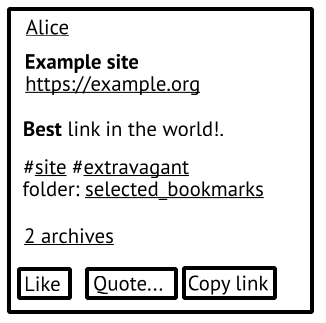
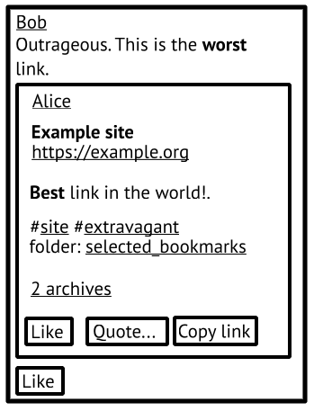

# FEP-4772: Representing bookmarks

## Summary
In social bookmarking networks, users publish bookmarks, which are annotated links, to the public. This FEP describes the model for such bookmarks and the practices for federating them.

## Requirements
The key words “MUST”, “MUST NOT”, “REQUIRED”, “SHALL”, “SHALL NOT”, “SHOULD”, “SHOULD NOT”, “RECOMMENDED”, “MAY”, and “OPTIONAL” in this specification are to be interpreted as described in [RFC-2119].

## Bookmarks
A bookmark is an object with the following data:

* The bookmarked URL.
* The bookmark title.
* Notes or a description of the bookmarked document.
* Any number of tags, and/or folders.
* Any number of copies of the document referenced by the bookmarked URL.

This definition of a bookmark is not to be confused with bookmarks found in microblogging software, where the word means “private likes”.

A social bookmarking service allows users to publish such bookmarks. It is sometimes called a (social) bookmark manager.

### Representation
A bookmark is represented with a `Note` object with the following conventions:

* `name` is the bookmark title.
* `source` is the source text of the bookmark description. The receiving bookmark manager SHOULD render it to the best of its abilities. The text MAY represent a hypertext document of varying complexity and be in any `mediaType`.
* `content` is an HTML representation of the bookmark intended for consumption by microblogging ActivityPub software. The receiving bookmark manager MAY choose to use this field as a substition for `source` if it does not support its `mediaType`.
* `attachment` MUST contain one `Link` object with its `href` set to the bookmarked URL.
* `attachment` MAY contain any number of `DocumentCopy` objects.
* `tag` MAY contain any number of `Hashtag` objects.
* `tag` MAY contain any number of `BookmarkFolder` objects.
* `url` is the URL of a human-readable representation of the bookmark. It MUST be resolvable and MUST NOT be the bookmarked URL.

To determine if a `Note` object is a bookmark `Note`, the following must be true:

* `name` is not empty.
* There is exactly one `Link` in `attachment`.

### Threadiverse compatibility
For compatibility with Lemmy, kbin, Azorius, and other similar projects, implementations MAY interpret incoming `Page` objects formatted per the aforementioned conventions as bookmarks.

### `BookmarkFolder`
There are two main approaches to organizing bookmarks: tagging, and the hierarchical approach with folders. Tags are a well-known entity on Fediverse already, the existing conventions are reused for them.

Some bookmark managers have both tags, and folders, distinct from each other. Folders are `BookmarkFolder` objects. It has fields `href`, and `name`.

In case a bookmark manager has folders only, it MAY serialize them as tags instead, for wider compatibility.

If a receiving bookmark manager has no concept of a folder and receives a bookmark in a folder, it MAY interpret it as a tag.

### `DocumentCopy`
Given the ephemeral nature of the World Wide Web, many bookmarking services offer their users the ability to make offline copies of bookmarked documents. This is often called archiving or making snapshots. To publish such an archive, include a `DocumentCopy` object in `Note`'s `attachment`:

* `id`
* `published` is when this copy was published.
* `summary` is a human-readable, likely human-written, description of this archive. Possibly empty.
* `original` is a `Document`, referenced or inline, possibly anonymous. The original document URL MAY be different from the bookmarked URL but it usually is equal to it.
* `copy` is a `Document`, referenced or inline, possibly anonymous. It is implied that the receiver has access to this document.

To publish new document copies for a bookmark, issue an `Update{Note}` activity with its `attachment` appended with a new `DocumentCopy`.

To delete a document copy, issue a `Delete{DocumentCopy}` activity. Note that there is no way to ensure proper deletion across the network. Users are advised to be cautious of document copies they publish. Bookmark managers MAY replace the document copy with a `Tombstone`.

## Quote bookmarks
Some bookmark managers have the notion of “quote bookmarks”, sometimes called “reposts” or “remarks”. A quote bookmark is a statement on some other regular bookmark, perhaps adding some notes of value or providing additional context. It has a set of tags, folders, and document copies distinct from the quoted bookmark. A quote bookmark MUST NOT have a `Link` attachment, and MUST NOT have a `name`.

Note that a quote bookmark of a quote bookmark is not possible.

### Representation

A quote post, as defined by [FEP-044f], quoting a bookmark Note as defined by this FEP SHOULD be interpreted as a quote bookmark.

An `Announce` of a bookmark `Note` SHOULD be interpreted as a quote bookmark with an empty quote text, no tags, no folders, no document copies. It is to be interpreted as a general endorsement of the bookmark across the network.

Implementations SHOULD send Quote Post representations of quote bookmarks and SHOULD accept both representations.

## UI considerations
*This section is non-normative.*

A bookmark could look like this:



A quote bookmark could look like this:



## Implementations
*This section is non-normative.*

* Betula sends bookmarks with `text/mycomarkup` source text and accepts bookmarks with `text/mycomarkup`, and `text/plain` source text. Betula sends, and accepts quote bookmarks represented as `Announce{Note}` activities.
* Ties sends bookmarks with empty `text/plain` source text.
* Omnom sends bookmarks with `text/plain` source text.
* Postmarks sends bookmarks with `text/plain` source text.

## Example
*This section is non-normative.*

```json
{
  "@context": [
    "https://www.w3.org/ns/activitystreams",
    {
      "Hashtag": "https://www.w3.org/ns/activitystreams#Hashtag",
      "BookmarkFolder": "https://w3id.org/fep/4772#BookmarkFolder",
      "DocumentCopy": "https://w3id.org/fep/4772#DocumentCopy"
    }
  ],
	"actor": "https://alice.example/@alice",
	"id": "https://alice.example/42?create",
	"object": {
		"actor": "https://alice.example/@alice",
		"attributedTo": "https://alice.example/@alice",
		"content": "(Irrelevant for this example.)",
		"id": "https://alice.example/42",
		"source": {
			"content": "**Best** link in the world.",
			"mediaType": "text/mycomarkup"
		},
		"name": "Example site",
		"attachment": [
			{
				"type": "Link",
				"href": "https://example.org"
			},
			{
			  "type": "DocumentCopy",
				"published": "2025-02-29T19:47:02Z",
				"summary": "Copy looks alright!",
				"original": {
				  "type": "Document",
					"url": "https://example.org"
				},
				"copy": {
				  "type": "Document",
					"url": "https://alice.example/docs/example-org-single-file.html"
				}
			},
			{
			  "type": "DocumentCopy",
				"published": "2026-02-29T19:47:02Z",
				"summary": "This one is broken somewhat.",
				"original": {
				  "type": "Document",
					"url": "https://example.org"
				},
				"copy": {
				  "type": "Document",
					"url": "https://alice.example/docs/example-org-broken.html"
				}
			}
		],
		"published": "2024-01-31T19:47:02Z",
		"tag": [
			{
				"href": "https://alice.example/tag/site",
				"name": "#site",
				"type": "Hashtag"
			},
			{
				"href": "https://alice.example/tag/extravagant",
				"name": "#extravagant",
				"type": "Hashtag"
			},
			{
				"href": "https://alice.example/folder/selected_bookmarks",
				"name": "selected_bookmarks",
				"type": "BookmarkFolder"
			}
		],
		"to": [
			"https://www.w3.org/ns/activitystreams#Public",
			"https://alice.example/followers"
		],
		"type": "Note"
	},
	"type": "Create"
}
```

## References

* [ActivityPub] Christine Lemmer-Webber, Jessica Tallon, Erin Shepherd, Amy Guy, Evan Prodromou, [AcitvityPub](https://www.w3.org/TR/activitypub/)
* [RFC-2119] S. Bradner, [Key words for use in RFCs to Indicate Requirement Levels](https://tools.ietf.org/html/rfc2119.html)
* [Activity Vocabulary] James M Snell, Evan Prodromou, [Activity Vocabulary](https://www.w3.org/TR/activitystreams-vocabulary/)
* [FEP-044f] Claire, [FEP-044f: Consent-respecting quote posts](https://codeberg.org/fediverse/fep/src/branch/main/fep/044f/fep-044f.md)

## Copyright

CC0 1.0 Universal (CC0 1.0) Public Domain Dedication

To the extent possible under law, the authors of this Fediverse Enhancement Proposal have waived all copyright and related or neighboring rights to this work.
