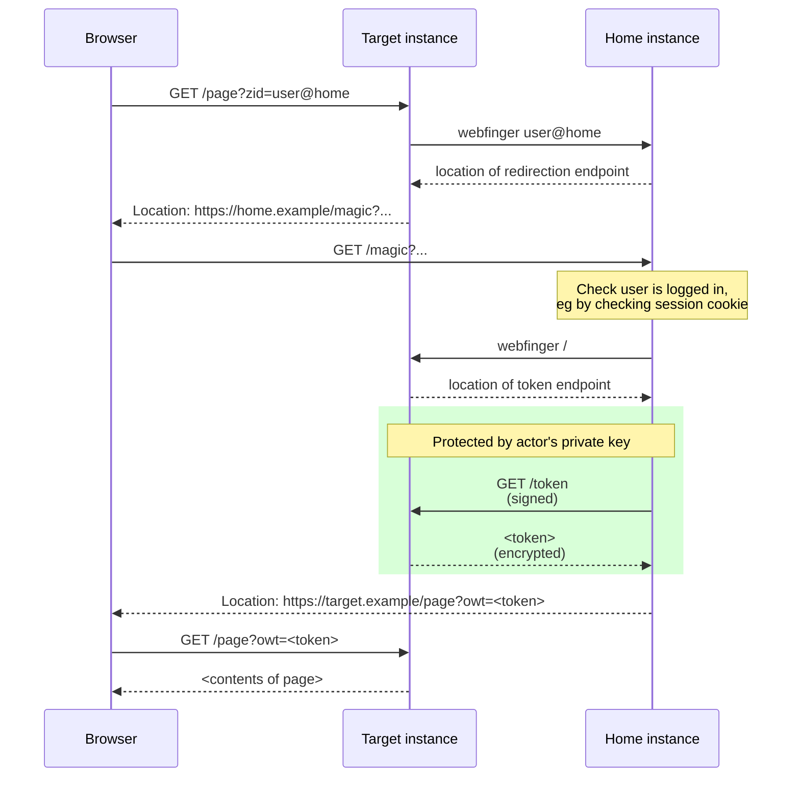

# FEP-61cf: The OpenWebAuth Protocol

OpenWebAuth is a federated remote authentication protocol. It can be used alongside protocols such as ActivityPub and Zot to add single sign-on to the Fediverse or to other "social web" projects such as blogs.

## Summary

OpenWebAuth is the "single sign-on" mechanism used by Hubzilla, (streams) and other related projects. It allows a browser-based user to log in to services across the Fediverse using a single identity. Once logged in, they can be recognised by other OpenWebAuth-compatible services, without third-party cookies and often without any explicit user interaction.

This is not a specification, a proposal, or a "best practice" document. The aim is to describe the existing protocol in detail as an aid to implementers, evaluators, and anyone who wants to understand its operation. It is mostly based on reverse-engineering the existing implementations and focuses on the minimal requirements for basic interoperability.

In OpenWebAuth, each user is identified by a public/private key pair. The protocol relies on there being a mechanism for other nodes on the network to discover a user's public key. This document assumes that ActivityPub actor objects will be used for this purpose. OpenWebAuth can also work with other protocols such as Zot6 and Nomad but these are not considered here.

## Overview

The protocol takes place between two participants:

 - The _home instance_, which hosts the user's identity, and is equivalent to the Identity Provider (IdP) in SAML and OpenID Connect.

 - The _target instance_, which allows remote users to log in to it using the provided identity. This is equivalent to the Relying Party (RP) in SAML and OpenID Connect.

### Starting the login flow

The OpenWebAuth login flow can begin in one of two ways:

- The user visits the target instance and sees a login screen. They type their Fediverse ID into a form field and click "Login".

- The user follows a link to the target instance. This link has a query parameter, `zid=`, which specifies the user's Fediverse ID.

This `zid=` mechanism is not necessarily specific to OpenWebAuth. It can be used to start an OAuth2-based login flow in just the same way. Implementers should note, though, that it can make attacks easier to launch; an attacker who can trick a victim into clicking a malicious link can cause them to start the login flow using a maliciously constructed identity, perhaps leading to a [MixUpAttack].

## Operation of the protocol

The protocol can be summarised in a sequence diagram as below. This diagram shows the `zid=` case, where the user is not prompted to log in.



Regardless of how the flow is started, the protocol begins with the user's browser making a request to the target instance.

### 1. Redirection to home instance

First the target instance identifies the home instance's "redirection endpoint".

Some existing implementations hard-code this to `/magic`. New implementations should perform a webfinger lookup on the provided user ID looking for a link with `rel` set to `http://purl.org/openwebauth/v1#redirect`. If found, this link's `href` should be used as the redirection endpoint.

The target instance constructs a URL from the redirection endpoint with the following query parameters:
- `owa`: must be set to 1
- `bdest`: The URL which the browser will be returned to after acquiring a token. This is encoded as UTF-8 and then converted to a hexadecimal string. This is equivalent to the `redirect_uri` in OAuth2. The `bdest` URL can include query parameters.

The user's browser is redirected to this URL. The target instance should check that the URL has the same origin as the webfinger ID, to avoid acting as an [open redirector](#open-redirection).

### 2. Home instance requests a token

The `/magic` endpoint at the user's home instance first checks that the user's browser has a valid session cookie.

If so, it decodes the `bdest` destination URL. It performs a webfinger lookup on the root URL of the destination site and looks for a link with `rel` set to `http://purl.org/openwebauth/v1`. This identifies the target instance's "token endpoint".

If an error occurs during this step, the home instance should not redirect to the 'bdest' URL; this would allow it to be used as an [open redirector](#open-redirection). Instead it should respond with a suitable HTTP error code.

On success, the home instance constructs and issues a signed HTTPS request to the discovered token endpoint. The request also contains an additional signed header, `X-Open-Web-Auth`, containing a random string. Target instances do not use this header; it is provided to add additional entropy to the signature calculation.

### 3. Target instance provides a token

The target instance's token endpoint extracts the `keyId`, fetches the actor record, extracts the public key and verifies the signature.

On success, it generates an URL-safe random string to use as a token. This token is stored locally, associated with the actor who signed the message. The token is also encrypted using the actor's public key and the RSA PKCS #1 v1.5 encryption scheme. The encrypted result is encoded as URL-safe Base64 with no '=' padding bytes.

Next it constructs the following JSON object in response:

```
{
   "success": true,
   "encrypted_token": <the base64-encoded token>
}
```

On failure it can also return a result with `success` set to false.

### 4. Home instance receives the token

The signed request issued in step 2 completes. The home instance decodes the JSON response and verifies that `success` is true. Next it decodes the Base64-encoded encrypted token and decrypts it using the actor's private key.

If successful, it takes the `bdest` destination URL, adds the query parameter: `owt=<decrypted token>`, and redirects the user's browser to it.

### 5. User returns to target instance

The user arrives back at the target instance. The target instance sees the `owt=` query parameter and checks its local storage for the token which it saved in step 3.

If found, this token identifies the remote user, and the target instance logs them in, overriding any existing login they may have. The token is also deleted from local storage so that it cannot be redeemed more than once.

## What Next?

*(This section is non-normative.)*

What does the target instance allow the user to do, now that they have signed in? The simplest option is to treat them as though they had signed in using a local username and password, but this isn't really enough.

In an [ActivityPub] context, a remotely authenticated user will expect to be able to post to the target instance using their existing identity. This poses the question of how the target instance should sign the post, since it does not have access to the user's private key. Hubzilla solves this by attributing the post to the user's identity, but signing it with a key belonging to the target instance; any other instance which receives the post must be aware of this mechanism, or the signature will be rejected.

## Additional notes

### HTTP Signatures

An OpenWebAuth signed request must have an `Authorization` header starting with the word `Signature` followed by the encoded HTTP signature. See [ActPubSig] for more details on signing Fediverse requests.

### Target instance's login check

To support logged in users, the target instance needs some logic to identify their requests. Normally this is done by checking for a valid session cookie. To support OpenWebAuth this logic must be extended to also check for the `zid=` and `owt=` query parameters.

Some corner cases are possible here. For instance, the user could already be logged in to the target instance when the OWA login flow begins.

When the OpenWebAuth flow succeeds, the `owt=` token will identify the logged-in user. It is important that the target instance trusts this token rather than the original `zid=` query parameter, to prevent an [impersonation attack](#impersonation-attack).

### Target instance's token endpoint

This endpoint should accept both GET and POST requests. Some home instances will issue POSTs with random bodies.

### Home instance's `/magic` endpoint

The implementation of this endpoint needs to request a login token from the target instance. This requires it to prove possession of the user's private key, first to calculate a signature for the request and then to decrypt the returned token. These are the only places in the protocol where the private key is needed, implying that only the home instance needs to be a Fediverse instance. The target instance only needs access to public keys, meaning that OpenWebAuth can be used to allow users to log into things that are not instances.

## Implementations

- [Hubzilla](https://framagit.org/hubzilla/core)
- [Streams](https://codeberg.org/streams/streams/)
- [Forte](https://codeberg.org/fortified/forte)
- [Friendica](https://github.com/friendica/friendica) (partial)
- [FedIAM](https://codeberg.org/FenTiger/FedIAM)

## Security Considerations

### Information leakage

The purpose of OpenWebAuth is to provide a strong guarantee of a user's identity to the web sites that they visit. This is often considered undesirable and consideration should be given to preventing this information from leaking to sites which may not be acting in the user's best interests.

This consideration may involve policies such as displaying a consent screen to the user or otherwise allowing them to choose which target instances they are willing to authenticate themselves to. The user's browser is redirected to their home instance at step 2, giving it an opportunity to implement policies such as these.

### Denial-of-service attack

Unused `owt=` login tokens are deleted after a couple of minutes. This protects against a potential DoS attack which could fill up the target instance's storage with unused tokens.

### Impersonation attack

Suppose Mallory is logged into his home instance as `mallory@example.social`. It is easy for him to manually navigate to a URL on Alice's instance which looks like `https://alice.social/somepage?zid=bob@example.social`. When the OpenWebAuth flow completes, Mallory will return to Alice's instance with an `owt=` token identifying him as `mallory@example.social`. It is important that Alice's instance trusts this `owt=` token. If it mistakenly trusts the original `zid=` parameter, Mallory will be able to impersonate Bob.

### Open redirection

OpenWebAuth involves redirecting the user's browser twice. It is important to verify the relevant URLs to avoid an [OpenRedirectionAttack].

The first redirection sends the user to their home instance's redirection endpoint (often `/magic`). If this endpoint is discovered via webfinger, the target instance should check that its hostname portion matches the hostname in the user's claimed ID.

The second redirection sends the user back to the URL specified in the `bdest` query parameter. This redirection should only take place if
* the token endpoint discovery step succeeded
* the discovered token endpoint URL has the same origin as the `bdest` URL

In any other case the home instance's redirection endpoint should return a suitable HTTP error code.

### Mixup attack

The `zid=` query parameter may make a [MixUpAttack] easier to launch, as discussed briefly above. This does not apply to OpenWebAuth but should be considered carefully when trying to generalise the `zid=` mechanism to other authentication protocols.

## References

- Christine Lemmer Webber, Jessica Tallon, [ActivityPub][ActivityPub], 2018
- Ryan Barrett, nightpool, [ActivityPub and HTTP Signatures][ActPubSig], 2024
- RFC9700, [Best Current Practice for OAuth 2.0 Security][MixUpAttack], 2025
- OWASP, [Unvalidated Redirects and Forwards Cheat Sheet][OpenRedirectionAttack]

[ActivityPub]: https://www.w3.org/TR/activitypub/
[ActPubSig]: https://swicg.github.io/activitypub-http-signature/
[MixUpAttack]: https://datatracker.ietf.org/doc/html/rfc9700#name-mix-up-attacks
[OpenRedirectionAttack]: https://cheatsheetseries.owasp.org/cheatsheets/Unvalidated_Redirects_and_Forwards_Cheat_Sheet.html#dangerous-url-redirects

## Copyright

CC0 1.0 Universal (CC0 1.0) Public Domain Dedication

To the extent possible under law, the authors of this Fediverse Enhancement Proposal have waived all copyright and related or neighboring rights to this work.
