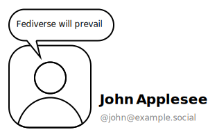
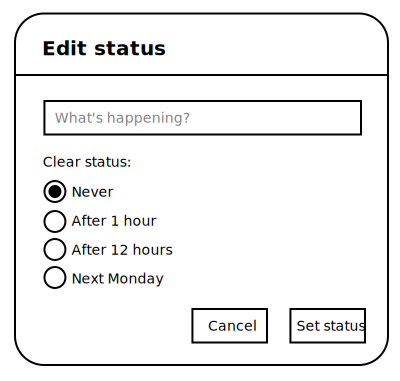
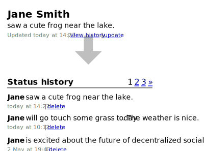

# FEP-82f6: Actor statuses


## Summary

This proposal describes an ActivityPub extension to allow actors to publish a short status text, with optional expiration, link attachment, and history.

Some centralized communication services provide their users with the ability to set a status on their account, which is usually displayed on their profile and sometimes next to their name in other places in the UI. These are distinct from regular posts because they can not be interacted with in any way whatsoever, can't contain media attachments, and usually have a short character limit on the order of several hundred characters at most. Statuses are always visible to anyone who can see the actor itself.

## Requirements

The key words “MUST”, “MUST NOT”, “REQUIRED”, “SHALL”, “SHALL NOT”, “SHOULD”, “SHOULD NOT”, “RECOMMENDED”, “MAY”, and “OPTIONAL” in this specification are to be interpreted as described in [RFC-2119].

## Representation of statuses

A status object is of type `ActorStatus`, which extends the ActivityPub `Object`. It has the following fields:

- `attributedTo`: the ID of the actor whose status this is. REQUIRED.
- `content`: the plain text content of the status. REQUIRED.
- `published`: the timestamp when this status update was created. REQUIRED.
- `id`: a unique identifier for this status update. REQUIRED.
- `endTime`: a timestamp when this status expires. OPTIONAL. If present, an implementation MUST check this field and, if it is in the past, MUST NOT display this status on the actor's profile and in any other places where statuses are displayed.
- `attachment`: an object that contains any extra information about what the actor is currently doing, e.g. a song they're listening to or a video game they're playing. OPTIONAL. If present, `content` MUST contain a fallback human-readable plain text representation of this object. For example, for a song, it may simply be "Artist — Title".

## Actor fields

The following two OPTIONAL fields are added to actors:

- `status`: the last, or current, status update of this actor. MUST NOT be present if the last status has expired. MUST contain an inlined `ActorStatus`.
- `statusHistory`: a collection of all past status updates of this actor. If present, implementations MAY provide a UI to view this actor's status history. If absent, implementations SHOULD NOT store this actor's past status updates and MUST NOT expose them in the UI.

## Activities

### Creating a status update

A status update is created by sending a `Create{ActorStatus}` activity to followers. Upon receiving this activity, an implementation updates the actor's latest status, and, if it has the `statusHistory` collection, adds it to the history. After sending this activity, the `status` field of the actor object MUST be updated with this new status. An `Update{Actor}` MUST NOT be sent because the `Create` already implicitly updates that field in the copies of this actor stored on remote servers.

If the actor does not have a `statusHistory`, the previous status is considered no longer existing, as if it was `Delete`d.

### Clearing the status

The latest status is cleared by sending a `Remove{ActorStatus}` activity to followers. Upon receiving this activity, if the ID of the `object` matches the actor's current status, an implementation removes the actor's current status. If the actor has the `statusHistory` collection, it keeps it there. Same considerations for `status` apply here.

### Deleting the status

A status is completely deleted by sending a `Delete{ActorStatus}` activity to followers. If the actor has the `statusHistory` collection, the status is removed from there as well as being cleared from the profile. Otherwise, this is activity is identical to `Remove`.

### Other activities in relation to statuses

Statuses can not be interacted with. Therefore, implementations SHOULD NOT send any activities that refer to statuses as their `object` attributed to actors other than the actor that owns this status. Implementations MUST either ignore any such activities by returning a 2xx response, or reject them by returning a 4xx.

Once published, a status object can not be `Update`d.

## Context

The JSON-LD context for this proposal is as follows:
```json
{
	"@context": [
		"https://www.w3.org/ns/activitystreams",
		{
			"sm": "http://smithereen.software/ns#",
			"ActorStatus": "sm:ActorStatus",
			"status": {
				"@type": "@id",
				"@id": "sm:status"
			},
			"statusHistory": {
				"@type": "@id",
				"@id": "sm:statusHistory"
			}
		}
	]
}
```

## Character limit

Implementations MUST support statuses of up to 100 characters or emoji. Implementations MAY allow statuses that are longer, but they MAY be truncated on the receiving side depending on display and storage constraints. It is RECOMMENDED to apply a 100-character limit to the text field where the user enters their status, but be more permissive when processing status updates from other servers.

## UI examples
*This section is non-normative.*

This section shows examples of how implementations might display status updates to users.

Simple UI without history, similar to Discord or GitHub:


Updating one's status, with the ability to set it to expire:


UI with history, similar to early Facebook:


## Example status object

```json
{
	"type": "ActorStatus",
	"id": "https://example.social/users/1/statuses/1747286633",
	"attributedTo": "https://example.social/users/1",
	"content": "is desperately trying to bring the old internet back",
	"published": "2025-05-15T05:23:53.539Z",
	"@context": [
		"https://www.w3.org/ns/activitystreams",
		{
			"sm": "http://smithereen.software/ns#",
			"ActorStatus": "sm:ActorStatus"
		}
	]
}
```

## References

- Christine Lemmer-Webber, Jessica Tallon, Erin Shepherd, Amy Guy, Evan Prodromou, [ActivityPub], 2018

[ActivityPub]: https://www.w3.org/TR/activitypub/

## Copyright

CC0 1.0 Universal (CC0 1.0) Public Domain Dedication

To the extent possible under law, the authors of this Fediverse Enhancement Proposal have waived all copyright and related or neighboring rights to this work.
