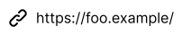
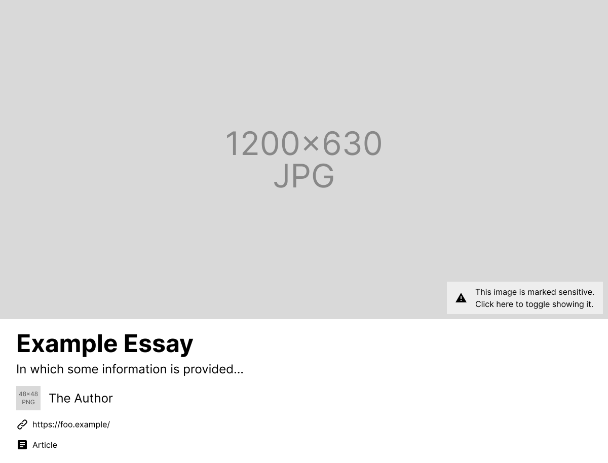

# FEP-8967: Generating link previews for attached links

## Summary

A common feature in social applications is to show users a rich preview of a link included in the content of a message or post, before the user clicks the link. Currently, applications like Mastodon generate link previews for the first link found in the content, without considering the publisher's possible intent. This FEP allows publishers to explicitly signal which links are intended for special processing, using the existing attachment model. Optionally, publishers can include their own link preview information so that trusting consumers can skip generating their own previews.

## Link in attachment

The attachment model can be used to indicate that something performs a particular function as an extension of the main content. [AS2-VOCAB] defines `attachment` as "semantically similar to attachments in email" for something that "potentially requires special handling".

Publishers MAY include a Link in `attachment` to signal that this link should be processed semantically as an attached link preview card, appearing similarly to attached images, attached videos, or attached audio. The link attachment MUST have an `href`, indicating that it is a `Link`.

```json
{
	"@context": "https://www.w3.org/ns/activitystreams",
	"attachment": {
		"href": "https://foo.example/"
	}
}
```

Upon encountering an `attachment` that is a `Link`, consumers SHOULD show this link as "attached" to the object. At minimum, the `href` can be rendered directly, perhaps alongside an icon representing a link.



## Link preview

Publishers MAY include link preview information using the `preview` property:

```json
{
	"@context": [
		"https://www.w3.org/ns/activitystreams",
		{
			"sensitive": "as:sensitive"
		}
	],
	"attachment": {
		"href": "https://foo.example/",
		"preview": {
			"type": "Article",
			"name": "Example Essay",
			"summary": "In which some information is provided...",
			"image": {
				"sensitive": true,
				"url": {
					"href": "https://cover-image.example/file.jpg",
					"mediaType": "image/jpg",
					"width": 1200,
					"height": 630
				}
			},
			"attributedTo": {
				"name": "The Author",
				"icon": {
					"url": {
						"href": "https://avatar.example/file.png",
						"mediaType": "image/png",
						"width": 48,
						"height": 48
					}
				},
				"url": {
					"href": "https://author.example/",
				}
			}
		}
	}
}
```

The exact form of the `preview` and its processing model is out of scope of this FEP (as each consumer is free to render information according to their own design language and understanding), but some properties may be useful as equivalents of OpenGraph properties which are widely used for link previews:

- `name` -- similar to `og:title`, indicate the preview card's primary text.
- `summary` -- similar to the `og:description`, indicate the preview card's secondary text.
- `image` -- similar to `og:image`, indicate the preview card's image.
- `type` -- similar to `og:type`, indicate the type of the target resource. This can be used to select an appropriate icon representing the resource.
- `attributedTo` -- loosely similar to `article:author`, `music:musician`, `music:creator`, `book:author`, and other such properties, indicate the preview card's attribution.
	- `name` -- the name that should be attributed
	- `icon` -- the icon that should be displayed alongside the attributed name
	- `url` -- the link that should wrap the attribution

Consumers that do not trust the publisher's provided `preview` information MAY generate their own preview through whichever means they find appropriate, such as for example fetching the link target and extracting OpenGraph information or HTML tags such as `<title>` or `<meta>`.



## Alternative approaches

(This section is non-normative.)

### Attaching objects directly

Rather than attaching a Link with an optional preview, resources can be attached directly by their `id` along with arbitrary optional claims.

```json
{
	"@context": "https://www.w3.org/ns/activitystreams",
	"attachment": {
		"id": "https://foo.example/",
		"type": "Article",
		"name": "Example Essay",
		// ...
	}
}
```

The difference between attaching an Object versus attaching a Link is that attaching an Object creates a direct relation between the current object and the attached object, whereas attaching a Link does not create this relation between two objects. For example, consider the difference between attaching an Image versus attaching a Link that targets an image. In most cases, directly attaching the Image is probably more appropriate. However, if the publisher attaches a Link instead, it might be because the link is present in the `content` and the publisher wishes to indicate this for special processing; for whatever reason, the publisher does not want to directly attach the Image. This depends on the specific details of the processing model, which is out of scope for this FEP.

## Implementations

- Mastodon 4.5: Intent to publish Link in attachment, per [Mastodon-PR]. Publishing link preview information is not currently planned at this time; Mastodon will instead consume attached links by their `href` as a signal to generate link previews with their existing OpenGraph logic. In the future, Mastodon plans to stop automatically extracting the first link in `content`, but for now the first link is used as a fallback in case no `attachment` is present.

## References

- James M Snell, Evan Prodromou, [Activity Vocabulary][AS2-VOCAB], 2017
- Gargron, [mastodon/mastodon#36104: Add support for Link objects in attachment][Mastodon-PR], 2025

[AS2-VOCAB]: https://www.w3.org/TR/activitystreams-vocabulary/
[Mastodon-PR]: https://github.com/mastodon/mastodon/pull/36104

## Copyright

CC0 1.0 Universal (CC0 1.0) Public Domain Dedication

To the extent possible under law, the authors of this Fediverse Enhancement Proposal have waived all copyright and related or neighboring rights to this work.
