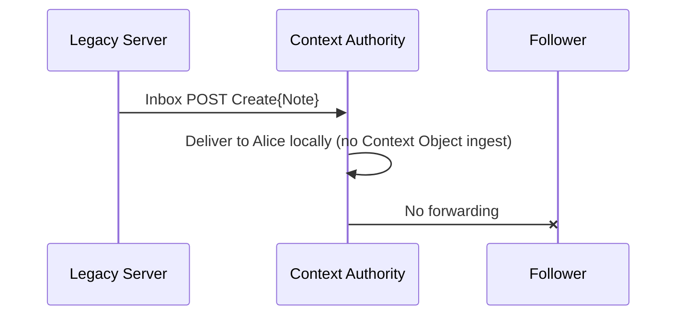

# FEP-8c13: Context-Authority Routing with Object Integrity Proofs for Restricted Threads

## Summary

In ActivityPub today, a reply to a "followers-only" post is delivered only to the *replier's* followers. Everyone
else in the conversation - including people who follow the original author - never sees it, so the thread fragments
into inconsistent partial views.

This proposal fixes that by giving every restricted thread a single coordinating server: the **Context Authority**,
which is the server that hosts the thread's root post. All replies, reactions, edits, and deletes for the thread are
sent to that one server, which validates them and fans them out to everyone currently allowed to see the thread.
Because all traffic flows through one authority, every participant converges on the same view.

### How it works, end to end

1. **Every thread has a Context Object** - a dereferenceable collection of the thread's *activities* (a FEP-7888 /
   [FEP-f228] collection of activities) hosted by the root author's server. Its URI is the `contextHistory` value
   carried on the thread's posts. Each post also carries an ordinary `context` value referencing the thread's
   [FEP-f228] *collection of posts*.
2. **A sender replies normally.** They use ordinary `to`/`cc` addressing (e.g. the author and their followers) and
   set `contextHistory` (and `context`). They do **not** put those URIs in `to`/`cc`. They deliver the reply to the
   root author's inbox.
3. **The Context Authority routes it.** The root author's server recognizes itself as the Context Authority for that
   `contextHistory`, validates the reply (authorization + addressing rules + integrity), stores it in the Context
   Object, and forwards it to everyone currently authorized.
4. **"Currently authorized" is the Thread Policy** - the `to`/`cc` of the root post as the Context Authority last
   published it. If the author later tightens or loosens visibility, the Context Authority republishes the root object
   via `Update`, and future activities are routed to the new audience.

### Why integrity proofs (FEP-8b32)

When the Context Authority forwards a reply, it may need to **rewrite** the reply's `to`/`cc` so that delivery matches
the current Thread Policy (for example, the audience changed since the reply was written). Plain HTTP Signatures only
prove who *delivered* a message, not who *wrote* it, and they break the moment an intermediary touches the payload.

So each sender attaches an **Author Proof**: a Data Integrity proof (FEP-8b32) computed over the activity *with
`to`/`cc` removed*. This applies to every kind of context activity - a reply, a like, a reaction, an announce, an edit,
a delete - not just posts. Excluding the addressing lets the Context Authority rewrite delivery without invalidating the
author's signature over the content, while recipients can still verify that the content was written by the claimed
author and not altered in transit. An optional **Forwarding Proof** lets the Context Authority additionally sign the
addressing it chose, so recipients can verify the routing offline instead of trusting only the transport.

### Backward compatibility

The `contextHistory` field and the proofs are additive: servers that don't understand them ignore them harmlessly,
while FEP-f228 servers obtain a usable thread from `context`. Such legacy servers can still receive forwarded replies and
reply into a thread (their reply reaches the directly addressed author), but they cannot originate or relay
integrity-protected context fan-out.

### Applicability across visibility classes

The same machinery serves every conversation visibility. For **direct** threads (addressed to explicit actors) and
**followers-only / private-group** threads, the audience is bounded and the Context Authority forwards to it directly.
For **public** threads the audience is unbounded, so the Context Authority pushes to the thread's **participants**
(everyone who has replied or reacted) plus the root author's followers, and serves all other readers by letting them
**pull** the thread from the Context Object. In every class the participants - including legacy servers - converge on
the same complete reply tree. See [Thread Visibility Classes](#thread-visibility-classes).

## Motivation

### The reply visibility trap

In current ActivityPub deployments, followers-only conversations fragment:

- Replies are delivered only to the replier's followers.
- Other authorized participants (e.g. followers of the original author) do not see all replies.
- The conversation splits into inconsistent partial views.

### Lack of object-level integrity

HTTP Signatures authenticate transport, not content. When inbox forwarding is used, recipients cannot verify that the
object content they receive was authored by the claimed actor and was not modified by an intermediate server. FEP-8b32
introduces per-object integrity proofs that decouple content verification from transport; this proposal builds on them.

A server that does not implement FEP-8b32 cannot participate in context fan-out as a sender (its activities will not be
forwarded), but may still receive forwarded activities and reply as a legacy endpoint.

### Related work

FEP-1b12 (Group Federation) established the pattern of a central actor (the Group) receiving activities and
redistributing them to members, which inspired the Context Authority model. FEP-1b12 targets explicit group membership
rather than ad-hoc conversations.

FEP-171b (Conversation Containers) defines a model where a single conversation owner distributes approved activities to
participants via wrapper activities. That approach and this proposal address the same class of problems with different
authority and delivery semantics.

| Dimension          | FEP-8c13 (Context Authority Routing)                      | FEP-171b (Conversation Containers)                        |
|--------------------|-----------------------------------------------------------|-----------------------------------------------------------|
| Core mechanism     | Native activities routed via `contextHistory` field       | Owner republishes activities via `Add` wrapper            |
| Authority model    | Context Authority validates and forwards eligible replies | Conversation owner explicitly approves and commits events |
| Commit semantics   | Rule-based inclusion (authorization + integrity)          | Explicit owner approval (`Add`)                           |
| Wire format        | Standard ActivityPub activities                           | `Add(Activity)` wrapper required                          |
| Integrity model    | Mandatory Data Integrity proof for context fan-out        | Proof optional; origin-fetch fallback allowed             |
| Mixed environments | Designed to degrade safely with legacy servers            | Assumes shared container semantics                        |
| Adoption surface   | Requires FEP-8b32; reuses existing AP fields              | Higher: introduces new behavioral contract               |

## Terminology

- **Context Authority**
  The server that hosts the Context Object and the thread's root object, subject to Root Authority Alignment. A valid
  Context Authority controls the Context Object URI and can authoritatively publish `Update` activities for the root
  object. If a `contextHistory` IRI resolves but violates Root Authority Alignment, it is not a valid Context Object
  under this FEP.
- **Context Object**
  A dereferenceable `OrderedCollection` holding the stream of **Context Activities** for a thread - its
  integrity-protected event log and the target of the `contextHistory` property (the *collection of activities* of
  [FEP-f228]). It is the container the Context Authority ingests into, fans out from, and serves for backfill.
- **Posts Collection**
  The [FEP-f228] *collection of posts*: an `OrderedCollection` of a thread's attributed objects (`Note`, `Article`,
  ...), identified by the ordinary `context` property. `context` resolves to the Posts Collection; `contextHistory`
  resolves to the Context Object.
- **Context Activity**
  Any ActivityStreams **activity** that participates in the thread lifecycle and is eligible for context fan-out,
  including but not limited to `Create`, `Update`, `Delete`, `Like`, `EmojiReact`, `Announce`, and `Undo`.
- **Thread Policy** (also **Top-Level Visibility**)
  The conversation's current visibility, defined by the root object's addressing (`to`/`cc`) as most recently published
  by the Context Authority via `Update`. It is **not** a one-time snapshot: it changes whenever the root object's
  addressing is updated. The Thread Policy determines who may receive thread content.
- **Authorized Recipient Set** (the **Context Audience**)
  The audience defined by the current Thread Policy (root `to`/`cc`) plus local policy (e.g. blocks, mutes). It may
  include collections (e.g. followers) and is not necessarily enumerable. It defines who **may** receive content
  (authorization), which is distinct from the **Delivery Target** (who is actively pushed to).
- **Delivery Target**
  The set of inboxes to which the Context Authority actively forwards (pushes) Context Activities. For threads with a
  bounded audience (direct, followers-only, private group) it equals the Authorized Recipient Set. For public threads,
  whose Authorized Recipient Set is unbounded, it is the Participation Set plus the root author's followers; all other
  authorized parties obtain content by **pull** (dereferencing the Context Object). Authorization governs who **may**
  see content; the Delivery Target governs who is **actively delivered to**. It is a set of delivery inboxes, not an
  addressing instruction, and is **never** enumerated into the forwarded `to`/`cc`.
- **Participation Set**
  The root author together with every actor whose Context Activity the Context Authority has ingested for a context.
  Because every Context Activity is routed through the Context Authority, this set is known to it and grows
  monotonically as the conversation proceeds. A Context Authority **MAY** restrict it to authors of `Create` activities
  (excluding mere reactors) to limit fan-out amplification. It is the push Delivery Target for public threads.
- **Effective Addressing**
  The addressing used for authorization and visibility comparisons. If the activity embeds its object and that embedded
  object contains `to`/`cc`, Effective Addressing is taken from the embedded object; otherwise from the activity's
  `to`/`cc`. A missing `to` or `cc` is treated as an empty array.
- **Author Proof**
  A Data Integrity proof produced by the activity's `actor`, computed after removing `to` and `cc` from the activity
  and any embedded object, and carried in a dedicated `authorProof` field. It binds the content to its author while
  letting the Context Authority rewire delivery addressing to match the current Thread Policy. It applies to every
  Context Activity (replies, likes, reactions, announces, edits, deletes), not only to posts. (See
  [Relationship to FEP-8b32](#relationship-to-fep-8b32-normative).)
- **Forwarding Proof** (optional)
  A Data Integrity proof produced by the Context Authority over the forwarded addressing (`to`/`cc`), referencing the
  Context Authority's instance-actor verification method. It binds the forwarded addressing (including any rewiring) to
  the activity, providing payload-level verification as an alternative to transport-level trust.
- **Integrity-Protected Activity**
  An activity carrying a verified Author Proof. When forwarded, it may also carry a Forwarding Proof.
- **Legacy Activity**
  An activity lacking an Author Proof.
- **Instance**
  The server controlling an object's or actor's `id`. "Same instance" as the root object means it can publish
  authoritative `Update` for that object and sign as the instance actor.
- **Instance Actor**
  The server's actor, used to sign and authenticate server-to-server requests. The instance actor **authoritative for a
  Context Object** is the one controlled by the instance hosting it (sharing the origin of the Context Object `id`).
  Recipients **MUST** confirm that the verification method used for transport authentication and for any Forwarding Proof
  is controlled by that instance.

## Data Model

### Context Object

The `contextHistory` property of an ActivityPub object **MUST** be an IRI identifying a dereferenceable Context Object
(the thread's *collection of activities*): an authorized `GET` returns an ActivityPub representation, while unauthorized
requests **MAY** receive 401/403 under the access control below. The ordinary `context` property separately identifies
the [FEP-f228] *collection of posts* (see [Posts Collection](#posts-collection-fep-f228)); it is not the Context Object.

The `contextHistory` property **MUST** be treated as a first-class payload reference, not an opaque identifier. The
Context Authority **MUST** resolve it to obtain authoritative metadata about the thread; other servers **SHOULD**
resolve it when they need backfill or authorization decisions.

The Context Object is authoritative for **thread history indexing and backfill discovery** only. **Authorization**
("who may receive content") is defined separately by the root object's current `to`/`cc` (the Thread Policy) plus local
policy. The Context Object does not encode membership; it indexes the thread's Context Activities for backfill and
convergence.

A Context Object URI **MUST** be stable and **SHOULD** be derivable. A simple, recommended construction is
`https://{context-authority}/history/{topLevelPostId}` for the Context Object (`contextHistory`) and
`https://{context-authority}/contexts/{topLevelPostId}` for the Posts Collection (`context`), allowing deterministic
discovery of both given the root object.

#### Root Authority Alignment (Normative)

For a context to be valid under this FEP, the Context Authority **MUST** be the same instance that hosts the root
object (the object whose `id` is the canonical top-level post for the thread), and **MUST** be able to authoritatively
publish `Update` activities for that root object.

This ensures that the entity controlling the Context Object is the same entity that can change the Thread Policy via
root object updates.

The Context Object:

- **MUST** be dereferenceable.
- **SHOULD** be an `OrderedCollection`.
- **SHOULD** be a collection of **Context Activities** suitable for backfill (not only replies).

Example:

```json
{
  "id": "https://alice.example/history/12345",
  "type": "OrderedCollection",
  "totalItems": 5,
  "first": "https://alice.example/history/12345?page=1"
}
```

#### Collection Contents (Normative)

When the `contextHistory` (Context Object) resolves to an `OrderedCollection`, that collection:

- **MUST** contain the stream of **Context Activities** (activities only) that define the thread's state and history.
- **MUST** contain activity IDs or embedded activities; bare objects **MUST NOT** appear.
- Ordering is implementation-defined.

#### Posts Collection

A Context Authority **SHOULD** also expose the thread as an [FEP-f228] *collection of posts*, identified by the ordinary
`context` property, for interoperability with servers that consume `context` as a collection of posts (Mastodon,
NodeBB, WordPress, Discourse, Lemmy, and others). When present, this collection **MUST** be an
`OrderedCollection` whose items are the thread's attributed objects (`Note`, `Article`, ...) rather than activities, per
[FEP-f228], and **SHOULD** be ordered chronologically. It carries no integrity or routing semantics; all routing,
ingestion, and fan-out operate on the Context Object identified by `contextHistory`.

#### Access Control for Limited-Visibility Contexts

For restricted conversations (followers-only, direct, etc.), the Context Authority **MAY** allow dereferencing of the
Context Object, the Posts Collection, and their collection pages, subject to strict access control. Authorization for
such dereferencing **MUST** be evaluated by the Context Authority using the current Thread Policy plus local policy.

A Context Authority **MAY** decline remote dereferencing entirely (always returning 401/403) and rely exclusively on
inbox delivery and forwarding for propagation, while still satisfying the dereferenceability requirement for local
processing and authorized local actors.

These access controls apply to the Context Object, the Posts Collection, and any collection pages or backfill endpoints
that enumerate their contents.

#### Authenticated Context Dereference (Restricted Contexts)

Dereferencing a restricted Context Object or Posts Collection **MUST** be authenticated by an actor-bound signature (authorized fetch);
instance-only signatures **MUST** be rejected. Because federation trust is instance-mediated this cannot guarantee
user-scoped enforcement - a server may proxy access to its own users - so a Context Authority **MAY** additionally
require an actor authorized under the current Thread Policy, with logging, rate limits, and auditing. This is distinct
from the instance-actor authentication used for forwarded deliveries.

### Context Activities and Integrity Proofs

When a Context Activity is ingested, its `contextHistory` reference **MUST** be resolved to the Context Object and
associated with it, not with the immediate parent (`inReplyTo`) alone. Servers **MUST NOT** treat `contextHistory` as
purely informational; it defines the authoritative thread context for history and lifecycle. (The activity's `context`,
when present, identifies only the Posts Collection.)

This applies to **every** activity type that participates in the thread - `Create`, `Update`, `Delete`, `Like`,
`EmojiReact`, `Announce`, `Undo`, etc. - not only to reply posts. In all cases `contextHistory` and the Author Proof are
carried on the **activity** itself (many activities, e.g. `Like`, `EmojiReact`, `Announce`, carry their target as an IRI
in `object` and have no embedded object).

When generating a Context Activity for a thread with a resolvable Context Object, implementations:

- **MUST** carry `contextHistory` on the **activity**; this is the routing anchor.
- **MUST** carry `context` on any embedded **object** (`Note`, `Article`, ...) so the post
  joins the thread's collection of posts.
- **SHOULD** also carry `contextHistory` on the embedded object and on the thread's top-level post.
- **MUST** include ordinary `to`/`cc` addressing as currently deployed (e.g. Mastodon-style), regardless of whether
  context routing is desired.
- **MUST NOT** include the `contextHistory` or `context` URIs in `to`/`cc`.
- For reply Notes specifically: **MUST** include `inReplyTo`.
- **MUST** include an Author Proof on the enclosing activity when requesting context fan-out.

#### Effective Context History IRI (Normative)

The routing anchor is the **`contextHistory`** value, determined as follows:

- If the activity contains `contextHistory`, the activity's value is the Effective Context History IRI.
- Otherwise, if the activity's object is embedded and contains `contextHistory`, that value is the Effective Context
  History IRI.
- If both are present and equal (string equality), that value is the Effective Context History IRI.
- If both are present and differ, the activity **MUST** be rejected by the Context Authority and by recipients
  implementing this FEP.
- If neither is present, the activity is not requesting context routing.

The `context` property is **never** the routing anchor and does not participate in this determination.

If both a legacy Linked Data `signature` and a Data Integrity `proof` are present, implementations **MUST** ignore the
legacy signature for object integrity.

All Context Activities intended for context fan-out **MUST** carry a valid Author Proof.

#### JSON-LD Context and Extension Terms (Normative)

`authorProof`, `forwardingProof`, and `contextHistory` are not defined by the ActivityStreams 2.0 context. Activities
carrying them **SHOULD** include an `@context` defining them, alongside the Data Integrity context from the deployment's
FEP-8b32 profile, so JSON-LD processors do not drop them:

```json
"@context": [
  "https://www.w3.org/ns/activitystreams",
  "https://w3id.org/security/data-integrity/v1",
  "https://w3id.org/fep/8c13"
]
```

The `https://w3id.org/fep/8c13` term context (provisional; to be assigned on publication) defines `authorProof` and
`forwardingProof` as `DataIntegrityProof` containers and `contextHistory` as an `@id` reference to the Context Object. The Data Integrity context **MUST** match the one used by the deployment's FEP-8b32 profile.

Because `eddsa-jcs-2022` canonicalizes the JSON document with JCS - including `@context` - signers and verifiers
**MUST** use the same `@context`; it is part of the Author Proof signed input and is **not** among the excluded fields.
Implementations that do not perform JSON-LD processing **MAY** treat `authorProof`/`forwardingProof` as plain JSON
members but **MUST** still reproduce the exact `@context` for canonicalization. The wire examples elsewhere in this
document show only the ActivityStreams context for brevity; conforming activities include the full `@context` above.

#### Author Proof Canonicalization (Normative)

The Author Proof uses the canonicalization and verification rules of FEP-8b32, with one addition defined here: certain
addressing and forwarding fields are excluded from the signed input. The Author Proof is carried in a dedicated
`authorProof` field (not `proof`); for the FEP-8b32 process, `authorProof` is the proof container.

Before canonicalization, the signer and all verifiers **MUST** remove the following fields from the activity and from
any embedded object: `to`, `cc`, and `forwardingProof`. The legacy Linked Data `signature` field **MUST** also be
excluded if present. No other fields may be excluded for Author Proof verification under this FEP. The removed fields
are treated as not part of the signed input.

The proof being verified is excluded as defined by FEP-8b32 (verifiers canonicalize the document without the
`authorProof` value they are verifying, and process its proof options without `proofValue`); this FEP does not alter
that base rule, only the field name.

#### Relationship to FEP-8b32 (Normative)

The Author Proof reuses the FEP-8b32 proof envelope and cryptosuite (e.g. `eddsa-jcs-2022`), but it is computed over a
**transformed input**: the activity with `to`, `cc`, and `forwardingProof` removed. This exclusion is deliberate - it
is precisely what lets the Context Authority rewrite delivery addressing to match the current Thread Policy without
invalidating the author's signature over the content.

FEP-8b32 and the `eddsa-jcs-2022` cryptosuite sign the **whole** document (minus the proof being verified) and have no
field-exclusion step. So an Author Proof is intentionally **not** a whole-document FEP-8b32 proof. To keep the two from
being confused, the Author Proof is carried in a dedicated **`authorProof`** field rather than the standard `proof`
field. This is what keeps the design compatible with FEP-8b32:

- A generic FEP-8b32 server does not recognize `authorProof`, ignores it as an unknown field, and never tries to verify
  it over the full payload. The standard `proof` field is left untouched and remains available for ordinary
  whole-document FEP-8b32 proofs on the object or activity.
- An implementation of this FEP knows to verify `authorProof` using the exclusion transform defined above.

In short, `authorProof` and `proof` are independent layers: `authorProof` provides author-authenticity that survives
address rewiring, while `proof` (if present) provides ordinary whole-document integrity. A deployment may use either or
both.

Because a whole-document `proof` signs `to`/`cc` (which the Author Proof deliberately excludes), such a proof is
invalidated whenever the Context Authority rewires addressing during forwarding. For context-routed activities the
Author Proof is therefore the **authoritative** content-integrity check. A whole-document `proof` on a context-routed
activity or its embedded object **MUST NOT** be relied upon to survive forwarding, and recipients **MUST NOT** reject a
context-routed activity solely because such a `proof` fails to verify; rejection is governed by the Author Proof and the
[Routing Decision Matrix](#routing-decision-matrix-normative). Senders that need content to remain verifiable across
forwarding **SHOULD** rely on the Author Proof rather than a whole-document `proof`.

#### Forwarding Proof Canonicalization (Normative, Optional)

The Forwarding Proof input **MUST** be a JSON object with exactly these keys:

- `id`: forwarded activity `id` (string)
- `type`: forwarded activity `type` (string)
- `actor`: forwarded activity `actor` (string IRI)
- `contextHistory`: Effective Context History IRI (string IRI)
- `object`: forwarded activity object (string IRI)
- `to`: forwarded `to` list, normalized as below
- `cc`: forwarded `cc` list, normalized as below
- `authorProofValue`: the `proofValue` of the verified Author Proof (string)

If the activity embeds its object, `object` is the embedded object's `id`; if `object` is an IRI, `object` is that
IRI; if neither is available, a Forwarding Proof **MUST NOT** be generated.

Absent `to`/`cc` are treated as empty arrays. If present, they **MUST** be arrays of IRI strings; any other form
(string singleton, object, non-IRI value) **MUST** cause Forwarding Proof generation or verification to fail. The `to`
and `cc` arrays **MUST** be normalized by removing duplicates (set semantics) and sorting lexicographically by Unicode
code points of the IRI string.

The resulting JSON object **MUST** be serialized using JSON Canonicalization Scheme (JCS, RFC 8785) before generating
the Data Integrity proof.

#### Proof Placement (Normative)

- The Author Proof **MUST** be carried in a dedicated `authorProof` field on the activity, with
  `proofPurpose: "assertionMethod"` and a `verificationMethod` belonging to the activity `actor`. It **MUST NOT** be
  placed in the standard `proof` field, which is reserved for ordinary whole-document FEP-8b32 proofs.
- When present, the Forwarding Proof **MUST** be carried in a separate `forwardingProof` field, with
  `proofPurpose: "assertionMethod"` and a `verificationMethod` belonging to the Context Authority's instance actor.

#### Integrity Requirements (Normative)

- A Context Authority **MUST NOT** context-forward an activity unless its Author Proof is present and verified.
- A receiving server implementing this FEP **MUST** verify the Author Proof for content authenticity.
- A receiving server implementing this FEP **MUST** authenticate the forwarding request via HTTP Signatures (or
  equivalent) as coming from the Context Authority.
- A receiving server implementing this FEP **SHOULD** verify the Forwarding Proof when present.
- For `Create` and `Update` activities that embed an object, the activity `actor` **MUST** equal the embedded object's
  `attributedTo`; the Context Authority **MUST** reject context routing for activities that violate this, since the
  Author Proof binds content to the activity `actor`. Delegated-authoring models are out of scope for this FEP.

#### Example: Incoming Reply (Sender → Context Authority)

The sender addresses the reply to match the Thread Policy (followers-only here). The Author Proof is computed with
`to`/`cc` excluded from the canonicalized input.

```json
{
  "@context": "https://www.w3.org/ns/activitystreams",
  "id": "https://bob.example/activities/98765",
  "type": "Create",
  "actor": "https://bob.example/u/bob",
  "contextHistory": "https://alice.example/history/12345",
  "to": ["https://alice.example/u/alice/followers"],
  "cc": ["https://alice.example/u/alice"],
  "object": {
    "id": "https://bob.example/posts/98765",
    "type": "Note",
    "attributedTo": "https://bob.example/u/bob",
    "inReplyTo": "https://alice.example/posts/12345",
    "context": "https://alice.example/contexts/12345",
    "content": "Hi Alice, I saw your followers-only post.",
    "to": ["https://alice.example/u/alice/followers"],
    "cc": ["https://alice.example/u/alice"]
  },
  "authorProof": {
    "type": "DataIntegrityProof",
    "cryptosuite": "eddsa-jcs-2022",
    "created": "2026-01-16T15:20:45Z",
    "verificationMethod": "https://bob.example/u/bob#main-key",
    "proofPurpose": "assertionMethod",
    "proofValue": "z3FXQjecWuf..."
  }
}
```

#### Example: Forwarded Reply (Context Authority → Recipient)

The Context Authority forwards the activity (no rewiring needed in this example). The Author Proof is unchanged (it was
computed without addressing fields). The optional Forwarding Proof is shown, signed by the Context Authority's instance
actor.

```json
{
  "@context": "https://www.w3.org/ns/activitystreams",
  "id": "https://bob.example/activities/98765",
  "type": "Create",
  "actor": "https://bob.example/u/bob",
  "contextHistory": "https://alice.example/history/12345",
  "to": ["https://alice.example/u/alice/followers"],
  "cc": ["https://alice.example/u/alice"],
  "object": {
    "id": "https://bob.example/posts/98765",
    "type": "Note",
    "attributedTo": "https://bob.example/u/bob",
    "inReplyTo": "https://alice.example/posts/12345",
    "context": "https://alice.example/contexts/12345",
    "content": "Hi Alice, I saw your followers-only post.",
    "to": ["https://alice.example/u/alice/followers"],
    "cc": ["https://alice.example/u/alice"]
  },
  "authorProof": {
    "type": "DataIntegrityProof",
    "cryptosuite": "eddsa-jcs-2022",
    "created": "2026-01-16T15:20:45Z",
    "verificationMethod": "https://bob.example/u/bob#main-key",
    "proofPurpose": "assertionMethod",
    "proofValue": "z3FXQjecWuf..."
  },
  "forwardingProof": {
    "type": "DataIntegrityProof",
    "cryptosuite": "eddsa-jcs-2022",
    "created": "2026-01-16T15:21:00Z",
    "verificationMethod": "https://alice.example/actor#main-key",
    "proofPurpose": "assertionMethod",
    "proofValue": "z4HYRkemXvg..."
  }
}
```

#### Example: Like (non-`Create` activity)

Context routing is not limited to posts. Likes, reactions, announces, edits, and deletes are Context Activities too. A
`Like` carries its target as an IRI in `object` (no embedded object), so `context` and the `authorProof` are carried on
the **activity**. The Author Proof is still computed with `to`/`cc` excluded.

```json
{
  "@context": "https://www.w3.org/ns/activitystreams",
  "id": "https://bob.example/activities/55512",
  "type": "Like",
  "actor": "https://bob.example/u/bob",
  "to": ["https://alice.example/u/alice/followers"],
  "cc": ["https://alice.example/u/alice"],
  "contextHistory": "https://alice.example/history/12345",
  "object": "https://alice.example/posts/12345",
  "authorProof": {
    "type": "DataIntegrityProof",
    "cryptosuite": "eddsa-jcs-2022",
    "created": "2026-01-16T15:25:10Z",
    "verificationMethod": "https://bob.example/u/bob#main-key",
    "proofPurpose": "assertionMethod",
    "proofValue": "z5KZ8nQ2tps..."
  }
}
```

## Addressing and Context-Routing Semantics

### Signaling Intent to Use Context Routing

When constructing a Context Activity for context-audience routing, the sender:

- **MUST** use ordinary `to`/`cc` addressing as currently deployed for that activity/object type (e.g. deliver replies
  to the root author and the followers collection where applicable per existing practice).
- **MUST NOT** address the activity more broadly than the `to`/`cc` of the object being replied to or reacted to (to
  preserve legacy safety). Senders **MAY** narrow by addressing a strict subset (e.g. explicit actor IRIs).
- **SHOULD**, for inherited visibility, copy the `to`/`cc` of the object being responded to (the root object for a
  direct reply to root, the immediate parent for a nested reply, the target object for a reaction) onto the new object.
- **MUST** carry `contextHistory` on the activity, and `context` on the embedded object when the activity embeds one.
- **MUST NOT** include the `contextHistory` or `context` URIs in `to`/`cc`.
- **MUST** include an Author Proof (see [Author Proof Canonicalization](#author-proof-canonicalization-normative)).

When requesting context routing, senders **MUST** deliver the Context Activity to the `inbox` (or
`endpoints.sharedInbox`) of the root object's author - i.e. the Context Authority instance per Root Authority Alignment.
The root object's `attributedTo` actor's `inbox` is the discovery target.

A receiving server treats an activity as requesting context routing only when both:

- the activity carries an Effective Context History IRI, and
- the receiving server is the Context Authority for that Effective Context History IRI (per Root Authority Alignment).

This specification requires **no** capability discovery or negotiation. Routing intent is expressed solely by the
presence of an Effective Context History IRI in the payload; whether routing occurs additionally depends on the receiver being
the Context Authority and on the validation requirements below.

### Normative Meaning of Effective Context History IRI

If an activity carries an Effective Context History IRI and the receiving server is the Context Authority for it, the activity
is requesting (a) ingestion into the thread as a Context Activity, and (b) potential forwarding to authorized
recipients, subject to the validation and integrity requirements below.

The presence of an Effective Context History IRI is **necessary but not sufficient** for context routing. Eligibility is
determined exclusively by a valid Author Proof and authorization checks - never by the perceived capabilities of the
sender's server.

**No capability negotiation (normative):**

- Senders **MUST NOT** gate sending on capability discovery for context routing.
- Context Authorities **MUST NOT** require recipients to advertise support before accepting context-routed activities.
- The presence of an Effective Context History IRI is the only signal of routing intent.

### Reply Visibility Rules

The Context Authority stores the Thread Policy as the root object's `to`/`cc`. An activity's effective visibility is
determined by comparing its Effective Addressing against the root object's current `to`/`cc`.

> These rules are written in terms of replies for readability, but apply to **all** Context Activities (replies,
> reactions, edits, deletes, etc.).

**Inherited ("follow-post") addressing:** Effective Addressing exactly equal (set-equality, order-insensitive) to the
root object's current `to`/`cc`. This signals "same visibility as thread." Inherited activities are forwarded with the
Thread Policy addressing.

**Narrowed addressing:** An activity **MAY** narrow visibility using any addressing forms permitted by ActivityPub
(individual actor IRIs and/or collections), provided every entry of its Effective Addressing is authorized under the
current Thread Policy and local policy.

**Address Filtering:** The Context Authority **MUST** compute the **filtered addressing** of every Context Activity:
the Effective Addressing with every entry removed that the Context Authority cannot verify as authorized under the
current Thread Policy and local policy. Verification uses locally available state for collections the Context Authority
controls (e.g. followers) and string-level comparison against the Thread Policy for all other entries; entries whose
authorization cannot be established (e.g. collections with unknown semantics, or the public sentinel when the Thread
Policy does not include it) **MUST** be removed.

- If the filtered addressing is empty, the activity **MUST** be rejected for context routing: the Context Authority
  cannot establish any authorized audience the sender intended, and substituting the Thread Policy could deliver a
  deliberately narrowed activity (e.g. one addressed only to a since-removed member) to recipients its author never
  chose.
- If the filtered addressing is non-empty, the activity **MUST** be forwarded with the filtered addressing. Filtering
  keeps the thread convergent when a sender composes addressing against a stale copy of the root object (for example,
  after the Thread Policy was tightened), while never delivering more broadly than the current Thread Policy permits.

The forwarded addressing **MUST NOT** contain any entry absent from the sender's Effective Addressing (no widening) and
**MUST NOT** be more permissive than the current Thread Policy. A Context Authority **MAY** additionally reject an
activity by local policy (for example, one whose Effective Addressing includes the public sentinel in a direct thread).
Filtering, not rejection, is the interoperable default for over-broad addressing: rejection does not prevent the
sender's own server from delivering the activity to the addressed audience, it only removes the activity from the
thread.

**Recipient set equality:** Two addressing fields are equal if they contain the same IRIs as a set, ignoring order and
duplicates. Implementations **MUST** canonicalize lists before comparison by removing duplicates and sorting
lexicographically by Unicode code points. Comparison is string-based only: implementations **MUST NOT** dereference
IRIs or apply semantic equivalence when comparing recipients.

## Thread Visibility Classes

This FEP applies to conversations of any visibility, but it separates two notions that the rest of this document treats
together for restricted threads:

- **Authorization** - who is *permitted* to receive the thread. Defined by the current Thread Policy (root `to`/`cc`)
  plus local policy. It governs the [Reply Visibility Rules](#reply-visibility-rules) and access control.
- **Delivery Target** - who the Context Authority *actively forwards to* (push). For a bounded audience this equals the
  Authorized Recipient Set; for an unbounded (public) audience it does not.

The Delivery Target is a set of **delivery inboxes**, not an addressing instruction. Forwarded `to`/`cc` continue to
follow the Thread Policy and the [Address Rewiring](#address-rewiring-normative) rules; the Context Authority
**MUST NOT** enumerate the Delivery Target into the forwarded `to`/`cc` (see
[Security Considerations](#security-considerations)).

Three visibility classes are distinguished by the root object's addressing:

| Class                          | Thread Policy (root `to`/`cc`) | Authorized Recipient Set        | Delivery Target (push)                       | Backfill (pull)               |
|--------------------------------|--------------------------------|---------------------------------|----------------------------------------------|-------------------------------|
| Direct                         | Explicit actor IRIs            | The listed actors (enumerable)  | = Authorized Recipient Set                   | Authorized actors             |
| Followers-only / private group | A collection (e.g. `followers`)| Collection members (may be non-enumerable) | = Authorized Recipient Set        | Authorized actors             |
| Public                         | Includes `as:Public`           | Everyone (unbounded)            | Participation Set + root author's followers  | Anyone (public Context Object)|

Followers-only and private-group threads are the default case described throughout this document: authorization and
delivery coincide, and the Context Authority forwards to the Authorized Recipient Set, expanding collections it
controls. The two subsections below add the rules for the direct and public classes.

### Direct Conversations (Normative)

When the Thread Policy is a set of explicit actor IRIs (a direct message or an enumerated private group), the
Authorized Recipient Set and the Delivery Target are both that explicit actor set, so Address Filtering under the
[Reply Visibility Rules](#reply-visibility-rules) is exact: any actor outside the set - and `as:Public` - is removed
from the forwarded addressing, and a reply retaining no member of the set is rejected. The Context Authority thus never
amplifies an over-broad reply beyond the member set; whether the sender's own server delivers that reply elsewhere is
outside the Context Authority's control, as in ordinary ActivityPub federation. Membership is changed by the root
author updating the root object's `to`/`cc`, propagated via
[Root Policy Update Propagation](#root-policy-update-propagation-normative).

The Author Proof is the primary defense against the Context Authority fabricating a message attributed to another
participant; recipients **MUST** reject forwarded activities whose Author Proof does not verify against the activity
`actor`. Routing through one instance still lets it withhold or reorder messages (forgery is prevented, censorship is
not), and this FEP provides no end-to-end confidentiality - direct content is visible to the Context Authority in
cleartext, as with ordinary ActivityPub direct messages.

#### Example: Direct Reply

Alice's root post is addressed to the explicit member set `{bob, carol}` (the Thread Policy). Bob replies; his Effective
Addressing `{alice, carol}` is a subset, so the Context Authority forwards it to Alice and Carol. Adding a member later
is just an `Update` to the root `to`/`cc`, after which the new actor's server backfills from the Context Object.

```json
{
  "@context": "https://www.w3.org/ns/activitystreams",
  "id": "https://bob.example/activities/3002",
  "type": "Create",
  "actor": "https://bob.example/u/bob",
  "contextHistory": "https://alice.example/history/3001",
  "to": [
    "https://alice.example/u/alice",
    "https://carol.example/u/carol"
  ],
  "object": {
    "id": "https://bob.example/posts/3002",
    "type": "Note",
    "attributedTo": "https://bob.example/u/bob",
    "inReplyTo": "https://alice.example/posts/3001",
    "context": "https://alice.example/contexts/3001",
    "content": "Works for me.",
    "to": [
      "https://alice.example/u/alice",
      "https://carol.example/u/carol"
    ]
  },
  "authorProof": {
    "type": "DataIntegrityProof",
    "cryptosuite": "eddsa-jcs-2022",
    "created": "2026-01-16T17:02:11Z",
    "verificationMethod": "https://bob.example/u/bob#main-key",
    "proofPurpose": "assertionMethod",
    "proofValue": "z6PkR2mWq8t..."
  }
}
```

### Public Conversations (Normative)

When the Thread Policy includes the public sentinel (`https://www.w3.org/ns/activitystreams#Public`, `as:Public`), every
actor is authorized, so the [Reply Visibility Rules](#reply-visibility-rules) permit any addressing. A reply **MAY**
still narrow its own visibility (e.g. a followers-only reply to a public post), which the Context Authority **MUST**
preserve and **MUST NOT** broaden back to Public.

Because the audience is unbounded, delivery is split between push and pull. The Context Authority maintains a
**Participation Set** - the root author plus every actor whose Context Activity it has ingested (optionally limited to
authors of `Create` activities, to curb amplification) - and **SHOULD** forward each ingested activity to the other
participants and to the root author's followers, deduplicated by `sharedInbox`. The forwarded `to`/`cc` stay as the
Thread Policy addressing (`as:Public` plus followers); the Participation Set only selects *inboxes* and **MUST NOT** be
enumerated into the addressing. Everyone else - readers who never engage - obtains the thread by **pull**, dereferencing
the (publicly readable) Context Object; a new participant backfills the same way on its first reply, then receives the
rest by push. On large threads the Context Authority **MAY** rate-limit, drop high-volume reactions from push, or fall
back to pull-only, provided the Context Object stays dereferenceable for backfill.

Because forwarded activities are native (`Create`, `Like`, etc.) with ordinary addressing, legacy servers among the
participants receive them as normal federated replies and gain a more complete thread with no code changes - which is
how this FEP closes the well-known fragmentation of public reply trees. *(informative)*

#### Example: Public Thread Fan-Out

Bob and Carol have already replied to Alice's public post, so the Participation Set is `{alice, bob, carol}`. Dave
replies publicly, delivering to Alice's inbox:

```json
{
  "@context": "https://www.w3.org/ns/activitystreams",
  "id": "https://dave.example/activities/4004",
  "type": "Create",
  "actor": "https://dave.example/u/dave",
  "contextHistory": "https://alice.example/history/4000",
  "to": ["https://www.w3.org/ns/activitystreams#Public"],
  "cc": [
    "https://alice.example/u/alice/followers",
    "https://alice.example/u/alice"
  ],
  "object": {
    "id": "https://dave.example/posts/4004",
    "type": "Note",
    "attributedTo": "https://dave.example/u/dave",
    "inReplyTo": "https://alice.example/posts/4000",
    "context": "https://alice.example/contexts/4000",
    "content": "Jumping in late - great thread.",
    "to": ["https://www.w3.org/ns/activitystreams#Public"],
    "cc": [
      "https://alice.example/u/alice/followers",
      "https://alice.example/u/alice"
    ]
  },
  "authorProof": {
    "type": "DataIntegrityProof",
    "cryptosuite": "eddsa-jcs-2022",
    "created": "2026-01-16T18:40:03Z",
    "verificationMethod": "https://dave.example/u/dave#main-key",
    "proofPurpose": "assertionMethod",
    "proofValue": "z7QmN4rXc9v..."
  }
}
```

## Context Authority Processing

When a Context Authority receives an activity whose Effective Context History IRI references a local Context Object, it **MUST**
process it per the steps below. Authorization to submit and to deliver is decided by the Context Authority using the
current Thread Policy (root `to`/`cc`) plus local rules (blocks, mutes).

### Validation

The Context Authority **MUST**:

1. Resolve the Effective Context History IRI and confirm it is a Context Object controlled by a local actor (per Root Authority
   Alignment).
2. Authenticate the sender via transport (HTTP Signatures or equivalent) and map the request to an ActivityPub actor.
3. Check sender authorization to submit Context Activities, informed by the current Thread Policy and local policy.
4. Apply Address Filtering to the activity's addressing per the [Reply Visibility Rules](#reply-visibility-rules),
   rejecting the activity if the filtered addressing is empty. Authorization evaluation **MUST** use locally available
   state for collections it controls (including followers) and any local policy inputs.
5. Verify the Author Proof: canonicalize with the Author Proof exclusions, then verify against the referenced
   verification method (which **MUST** belong to the activity's `actor`). An Author Proof is **verified** iff present
   and successfully verified.

The Context Authority then applies the [Routing Decision Matrix](#routing-decision-matrix-normative). In particular:

- Author Proof **present but invalid/unverifiable** → **MUST reject** (regardless of authorization). This prevents
  acceptance of tampered content.
- Author Proof **absent** → treat as legacy: local delivery to directly addressed recipients **MAY** occur, but the
  Context Authority **MUST NOT** ingest and **MUST NOT** context-forward. It **SHOULD** apply local anti-abuse checks
  and **MAY** reject by local policy.
- Author Proof **verified** → sender authorization checks **MUST** be enforced; unauthorized senders **MUST** be
  rejected, authorized senders **MUST** be ingested and forwarded.

#### Transport Authentication (Normative)

- HTTP Signatures (or equivalent) **MUST** authenticate the sending server and bind the delivery to an ActivityPub
  actor identity for authorization checks.
- HTTP Signatures **MUST NOT** be treated as sufficient for content integrity of forwarded activities; content
  integrity is provided by the Author Proof.

### Routing Decision Matrix (Normative)

Context-audience routing **MUST** be integrity-protected: the Context Authority **MUST NOT** forward any Context
Activity unless it carries a **verified** Author Proof. This is absolute and independent of the sender's implementation
or perceived capabilities. The Context Authority **MUST** determine routing solely from the activity payload and local
authorization policy:

| Effective Context History IRI | Author Proof                 | Sender Authorized | Required Behavior                                                                              |
|-----------------------|------------------------------|-------------------|-----------------------------------------------------------------------------------------------|
| No                    | Any                          | Any               | Treat as ordinary ActivityPub delivery                                                        |
| Yes                   | Absent                       | Any               | MAY deliver to directly addressed local recipients; **MUST NOT** ingest; **MUST NOT** forward |
| Yes                   | Present but invalid          | Any               | **MUST reject**                                                                                |
| Yes                   | Present and verified         | No                | **MUST reject**                                                                                |
| Yes                   | Present and verified         | Yes               | **MUST ingest** and **MUST forward** (rewiring as needed; MAY add a Forwarding Proof)          |

No additional server capability checks or negotiations are permitted or required.

### Ingestion

For Context Activities from authorized senders with a verified Author Proof, the Context Authority **MUST** persist the
activity/object and **MUST** add the activity ID to the Context Object's collection (`contextHistory`). When the
activity creates or updates a post, the Context Authority **SHOULD** also reflect that post in the Posts
Collection (`context`).

Activities lacking a valid Author Proof **MAY** be delivered to directly addressed local recipients (subject to local
policy) but **MUST NOT** be added to the Context Object's collection and are ineligible for context-audience routing.

### Forwarding

For Context Activities eligible for context-audience routing, the Context Authority:

- **MUST** forward the activity to the current **Delivery Target** using standard inbox forwarding. The Delivery Target
  is defined per [Thread Visibility Classes](#thread-visibility-classes): for bounded audiences (direct, followers-only,
  private group) it is the Authorized Recipient Set; for public threads it is the Participation Set plus the root
  author's followers, with all other parties served by pull.
- **MUST NOT** forward to any recipient not authorized under the current Thread Policy and local policy (blocks, mutes,
  etc.).

Forwarding **MUST NOT** depend on the perceived compliance or capabilities of recipient servers. Expanding a local
follower collection to its remote inboxes does not require rewriting the activity's addressing.

#### Address Rewiring (Normative)

The Context Authority **MUST NOT** rewrite `to`/`cc` to enumerate individual actor IRIs solely to target specific
recipients.

The Context Authority **MAY** rewrite `to`/`cc` to make forwarded deliveries conform to the current Thread Policy,
including when the Thread Policy changed since the sender last observed the root object.

If the sender's Effective Addressing contains entries not authorized under the current Thread Policy, the Context
Authority **MUST** forward the activity with its filtered addressing, or reject it if the filtered addressing is empty,
per Address Filtering in the [Reply Visibility Rules](#reply-visibility-rules).

When forwarding an embedded-object activity, rewiring **MUST** be applied consistently:

- If the embedded object contains `to`/`cc`, the forwarded activity **MUST** set the embedded object's `to`/`cc` to the
  forwarded addressing.
- The forwarded activity **MUST** set the activity-level `to`/`cc` to the same sets as the embedded object's (set
  equality), to avoid recipient divergence.
- A Context Authority **MAY** omit object-level `to`/`cc` only if it also omits them on the embedded object and relies
  exclusively on activity-level addressing; if the embedded object includes `to`/`cc`, omission is **NOT RECOMMENDED**.

#### Content Immutability (Normative)

The Context Authority **MUST NOT** modify any field included in the Author Proof input. Any forwarder mutation **MUST**
be limited to the excluded fields (`to`, `cc`, `forwardingProof`). If any other modification would be required, the
Context Authority **MUST** reject the activity for context routing (it **MAY** still deliver it locally to directly
addressed recipients per legacy behavior).

#### Transport Authentication for Forwarded Deliveries (Normative)

A recipient implementing this FEP **MUST** authenticate forwarded deliveries via HTTP Signatures (or equivalent) and
**MUST** confirm the request is verifiable using a verification method controlled by the Context Authority's instance
actor for the referenced Context Object. This transport-level check is the **baseline** for accepting forwarded
activities: it ensures any addressing updates were performed by the Context Authority without requiring payload-level
proofs.

#### Payload/Transport Binding (Normative, Best-Effort)

Recipients **SHOULD** require a request signature profile that binds the request body (e.g. via the `Digest` header, or
`Content-Digest`/`Repr-Digest` per RFC 9530) when available. If body binding is unavailable, recipients **MAY** accept forwarded deliveries but **MUST** treat addressing
updates as transport-trusted rather than payload-verifiable.

#### Optional Forwarding Proof (Normative, Optional)

Implementations **MAY** attach and verify a Forwarding Proof that cryptographically binds the forwarded `to`/`cc` to the
Context Authority, enabling offline verification and reducing reliance on transport-layer body binding. It provides
defense-in-depth: even if transport authentication is compromised, the payload-level proof shows the addressing was
authorized by the Context Authority.

When a Context Authority attaches a Forwarding Proof, it **MUST** be computed per
[Forwarding Proof Canonicalization](#forwarding-proof-canonicalization-normative-optional) and placed in the
`forwardingProof` field.

When a recipient receives a Forwarding Proof, it **SHOULD** verify it and **MAY** treat success as a stronger signal
than transport authentication alone. On failure, it **SHOULD** fall back to transport authentication and **MAY** log
the failure.

### Recipient Processing (Normative)

When a server implementing this FEP receives a context-routed activity, it **MUST**:

1. **Verify transport authentication.** Confirm the HTTP request is verifiable using a verification method controlled by
   the Context Authority's instance actor for the referenced Context Object - the instance actor sharing the origin of
   the Context Object `id` (Root Authority Alignment). A forwarded delivery whose signer is not controlled by that
   origin **MUST** be rejected. On failure, **MUST reject**.
2. **Verify the Author Proof.** Canonicalize with the Author Proof exclusions, then verify `authorProof` against the
   activity `actor`'s verification method. On failure, **MUST reject**.
3. **Verify the Forwarding Proof if present.** Recipients **SHOULD** verify it chains to the Context Authority's
   instance-actor key for the resolved Context Object and binds to the Author Proof (via the committed
   `authorProofValue`). On success, treat addressing updates as payload-verified; on failure, **MAY** fall back to
   transport-authenticated delivery (and **MAY** log).
4. **Accept.** If transport authentication passes and the Author Proof verifies, accept the activity, subject to local
   policy (blocks, mutes, etc.).

No additional recipient-side authorization checks are required: the Context Authority's transport-authenticated delivery
implies the recipient is in the authorized audience. Recipients treat the Context Authority as the policy oracle for
delivery authorization, and **MUST** evaluate visibility/presentation using Effective Addressing.

### Root Policy Update Propagation (Normative)

When the root object's addressing (`to`/`cc`) changes, the Context Authority **MUST** publish an `Update` activity whose
`object` is the full updated root object (same `id`), and **MUST** deliver it per ordinary ActivityPub delivery.

Receiving servers implementing this FEP **MUST** update their stored copy of the root object upon accepting the
`Update`, and **MUST** treat the updated addressing as the current Thread Policy for the context.

### Deletion Fallback on Policy Tightening (Normative, Optional)

An `Update` cannot make servers that do not implement this FEP stop displaying the root object (see
[Visibility Changes and Retroactive Tightening](#visibility-changes-and-retroactive-tightening-informative)). When a
Thread Policy change leaves a server with no authorized recipients, deletion is the correct end state for that server's
copy whether or not it implements this FEP.

When the root object's addressing is updated, the Context Authority **MAY** deliver a `Delete` activity for the root
object to each known server that previously received the root object but hosts no actor authorized under the current
Thread Policy. For servers implementing this FEP, the `Delete` is an explicit trigger for the purge described in
[Context Retention and Deletion](#context-retention-and-deletion-normative); for other servers, it is the only signal
that removes the object from display.

The Context Authority **MUST NOT** deliver such a `Delete` to a server that hosts at least one actor authorized under
the current Thread Policy.

This mechanism is best-effort. The set of servers holding a copy is approximated from the Context Authority's delivery
and interaction records; for threads whose Thread Policy previously included `as:Public`, copies obtained through
relays, third-party announces, or ad-hoc fetches may reside on servers unknown to the Context Authority. After the
policy change, the access controls of
[Access Control for Limited-Visibility Contexts](#access-control-for-limited-visibility-contexts) prevent unauthorized
re-fetching of the root object, so such copies cannot be refreshed.

### Thread Visibility Re-evaluation (Normative)

Upon learning an updated root object addressing for a context (via `Update`), a receiving server implementing this FEP
**SHOULD** re-evaluate which local users are authorized under the current Thread Policy, and **SHOULD** restrict
presentation of previously stored context items accordingly. It **MAY** retain stored objects for legal, abuse, or
operational reasons, but **MUST** treat them as not visible to unauthorized local users. For contexts that have become
unauthorized for all local users, servers **SHOULD** minimize retention duration and metadata exposure, consistent with
the deletion guidance in [Context Retention and Deletion](#context-retention-and-deletion-normative).

### Context Discovery and Backfill (Normative)

When a server begins hosting an actor that becomes part of the Context Audience *after* a conversation has started (e.g.
Bob follows Alice mid-thread), the server **SHOULD** attempt to discover and backfill the context, subject to local
policy, resource limits, and authorization constraints.

**Discovery trigger:** Discovery **SHOULD** be triggered when a server learns it hosts an actor authorized under the
current Thread Policy for a context and has learned one or more Context Object URIs for it.

**Discovery procedure:**

1. The server **SHOULD** attempt to dereference the Context Object URI.
2. If access is permitted, it **SHOULD** retrieve the Context Object and enumerate its items.
3. It **SHOULD** fetch and ingest referenced Context Activities (replies, reactions, updates, deletes, etc.), subject
   to local retention policy and resource limits.

Consistent with [FEP-f228], a server backfilling a thread **SHOULD** prefer `contextHistory`, **MAY** fall back to `context` 
when it only needs the posts, and **MAY** fall back to recursive `replies` traversal when neither is
available.

**Fallback (normative):** If the Context Authority does not permit remote dereferencing, or dereferencing fails due to
authorization or network constraints, the server **MUST** treat backfill as unavailable and rely solely on delivered
activities. Full history convergence is then not guaranteed.

**Suggested limits (non-normative):** apply paging, caps on pages/items per context, and/or incremental ("newest
first") backfill to reduce amplification risk and allow partial convergence under load.

#### Example: Mid-Thread Follow

Alice creates a followers-only thread. Bob follows Alice after 5 Context Activities already exist. Bob's server performs
`GET https://alice.example/history/12345`, receives an `OrderedCollection` with 5 items, and backfills all 5 (including
non-reply events such as reactions or edits) to present a complete conversation view.

### Context Retention and Deletion (Normative)

If a server reasonably determines (from locally observable state) that it no longer hosts **any** actor authorized under
the current Thread Policy for a Context Object, it **SHOULD** delete its entire local copy of that context - the Context
Object, the Posts Collection, and all Context Activities associated exclusively with it - subject to local policy and
legal/operational
constraints. Implementations **SHOULD** apply a grace period to avoid thrash from transient authorization changes.

This prevents indefinite retention of private or restricted conversations by unrelated servers.

#### Example: Audience Exhaustion

Bob and Carol both unfollow Alice; no local actors remain in Alice's Context Audience. Bob's server **SHOULD** delete
`https://alice.example/history/12345` (and the Posts Collection `https://alice.example/contexts/12345`) and all Context
Activities belonging solely to that context. If Bob later re-follows Alice, the context is rediscovered and backfilled
per the previous section.

### Context History Resolution

When resolving a `contextHistory` URI, the receiving server **MUST** resolve it to a Context Object and associate
Context Activities with that object. The `contextHistory` **MUST NOT** be resolved to the root `Note` object, an
`inReplyTo` chain, or a transient/inferred thread identifier. The Context Object is the **sole authoritative container**
for the conversation's activity history, ensuring consistent backfill, authorization checks, and lifecycle management
across servers. The `context` URI resolves separately to the Posts Collection and **MUST NOT** be treated as
the Context Object.

### Design Note (Non-Normative)

This mechanism intentionally avoids explicit capability discovery. Compliance is inferred *per activity* from payload
semantics: an Effective Context History IRI signals routing intent; a valid Author Proof signals eligibility; transport
authentication (HTTP Signatures) is the baseline for trusting context-forwarded delivery; and an optional Forwarding
Proof provides enhanced payload-level verification. This eliminates downgrade attacks via mixed-compliance networks and
allows gradual adoption without coordination.

## Legacy Interoperability

### Unknown `contextHistory` Field (Informative)

Servers that do not implement this FEP ignore the `contextHistory` field and the proofs, so including them is safe: they
cause no extra fetches and no effect on access control. FEP-f228 servers understand the ordinary `context` property
and obtain a usable collection of posts from it.

### Acceptance of Legacy Objects

A Context Authority **MAY** accept legacy objects (objects lacking a valid Author Proof) from legacy peers if the
activity is directly addressed to a local actor and local federation policy permits. Acceptance does **not** imply
eligibility for context routing.

### Forwarding Restrictions for Legacy Objects

Legacy activities:

- **MUST NOT** be forwarded via context-audience routing.
- **MUST NOT** be injected into integrity-protected conversation fan-out.
- **MAY** be delivered only to explicitly addressed local recipients.

This ensures recipients relying on integrity guarantees never receive unverifiable content through protected channels.

### Replies Originating from Legacy Servers

When a legacy server replies to a restricted thread, the reply **MAY** be visible to the directly addressed recipient
(e.g. the root author) and **MAY** be associated with that recipient's local thread view, but **MUST NOT** be forwarded
to the Context Audience. This reflects the limited guarantees of legacy federation while preserving conversation
integrity for protected participants.

**Example legacy reply (delivered as a `Create`):**

```json
{
  "@context": "https://www.w3.org/ns/activitystreams",
  "id": "https://legacy.example/activities/55555",
  "type": "Create",
  "actor": "https://legacy.example/u/charlie",
  "to": ["https://alice.example/u/alice"],
  "object": {
    "id": "https://legacy.example/posts/55555",
    "type": "Note",
    "attributedTo": "https://legacy.example/u/charlie",
    "inReplyTo": "https://alice.example/posts/12345",
    "content": "Hello Alice!",
    "to": ["https://alice.example/u/alice"]
  }
}
```

This activity lacks an Author Proof, so it cannot be context-forwarded but may be delivered to the directly addressed
recipient (Alice).

**Sequence: Legacy Reply**



## Security Considerations

- Context Authorities **MUST** enforce blocklists and moderation policies before ingestion.
- For limited-visibility contexts, Context Authorities **MUST** restrict dereferencing of Context Objects.
- Forwarded activities **MUST NOT** enumerate recipients by expanding collections (e.g. followers) into individual actor
  IRIs in the payload; forwarded addressing **SHOULD** preserve collection-based addressing when present in the Thread
  Policy.
- Objects failing integrity verification **MUST** be rejected and **SHOULD** be logged.
- Legacy acceptance **MUST NOT** weaken integrity guarantees for protected threads.
- Because contexts may backfill reactions, edits, and deletes, implementations **SHOULD** apply local rate limits and
  abuse controls to Context Activity ingestion (especially high-volume reaction types) to prevent amplification through
  fan-out.
- For public threads, participation-set fan-out is bounded but can be large; Context Authorities **SHOULD** deduplicate
  deliveries by shared inbox, **SHOULD** rate-limit, and **MAY** fall back to pull-only above a local threshold while
  keeping the Context Object dereferenceable for backfill.
- For direct threads, routing through a single Context Authority means it can withhold or reorder messages even though
  the Author Proof prevents forgery; this FEP provides no end-to-end confidentiality, and the Context Authority sees
  direct content in cleartext.

### Visibility Changes and Retroactive Tightening (Informative)

Updating the root object's addressing lets compliant implementations retroactively restrict presentation of previously
stored thread items for local users no longer authorized under the updated Thread Policy. This provides no guarantee of
content recall across the federation:

- Servers that do not implement this FEP may continue to display previously delivered content. In particular, several
  widely deployed implementations treat an object's visibility as immutable after first receipt and discard the
  addressing carried by an `Update` while applying its content changes. On such servers the root object remains
  displayed at its original visibility indefinitely, and content edits published after a tightening continue to reach
  the original, broader audience there.
- Users may have copied or screenshotted content before the change.
- The Context Authority cannot force remote servers to delete or hide content; the
  [Deletion Fallback on Policy Tightening](#deletion-fallback-on-policy-tightening-normative-optional) removes the
  root object only from servers that host no authorized recipients.

Tightening is therefore reliable only across servers implementing this FEP. Implementations acting as Context Authority
SHOULD surface this limitation to users when a visibility change is privacy-motivated (for example, by offering
delete-and-repost as an alternative).

This limitation is inherent to federated systems: the policy update mechanism provides best-effort restriction for
compliant implementations, not guaranteed erasure.

## References

- [FEP-7888: Demystifying the context property](https://codeberg.org/fediverse/fep/src/branch/main/fep/7888/fep-7888.md)
- [FEP-f228: Backfilling conversations](https://codeberg.org/fediverse/fep/src/branch/main/fep/f228/fep-f228.md)
- [FEP-8b32: Object Integrity Proofs](https://codeberg.org/fediverse/fep/src/branch/main/fep/8b32/fep-8b32.md)
- [FEP-1b12: Group Federation](https://codeberg.org/fediverse/fep/src/branch/main/fep/1b12/fep-1b12.md)
- [FEP-171b: Conversation Containers](https://codeberg.org/fediverse/fep/src/branch/main/fep/171b/fep-171b.md)
- [ActivityPub §7.1.2 Forwarding from Inbox](https://www.w3.org/TR/activitypub/#inbox-forwarding)
- [JSON Canonicalization Scheme (JCS), RFC 8785](https://www.rfc-editor.org/rfc/rfc8785)

## Copyright

CC0 1.0 Universal (CC0 1.0) Public Domain Dedication

To the extent possible under law, the authors of this Fediverse Enhancement Proposal have waived all copyright and
related or neighboring rights to this work.
