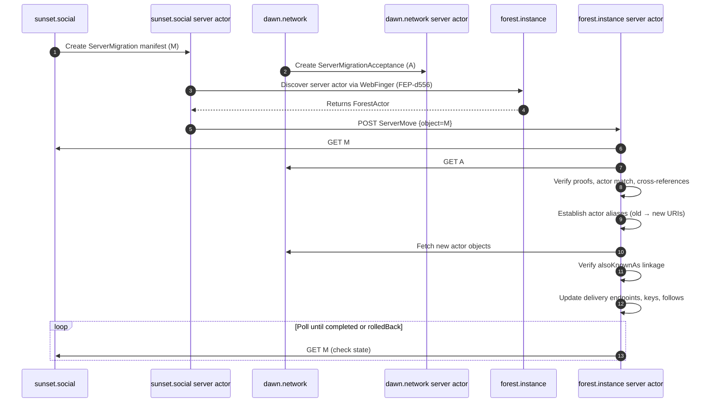
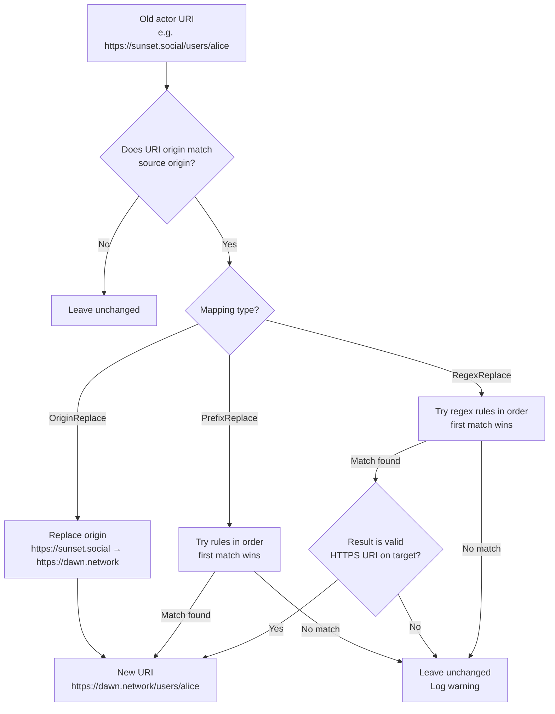
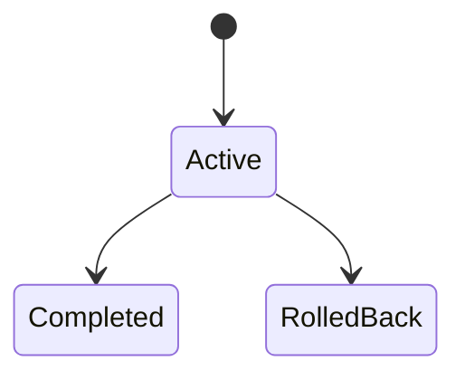
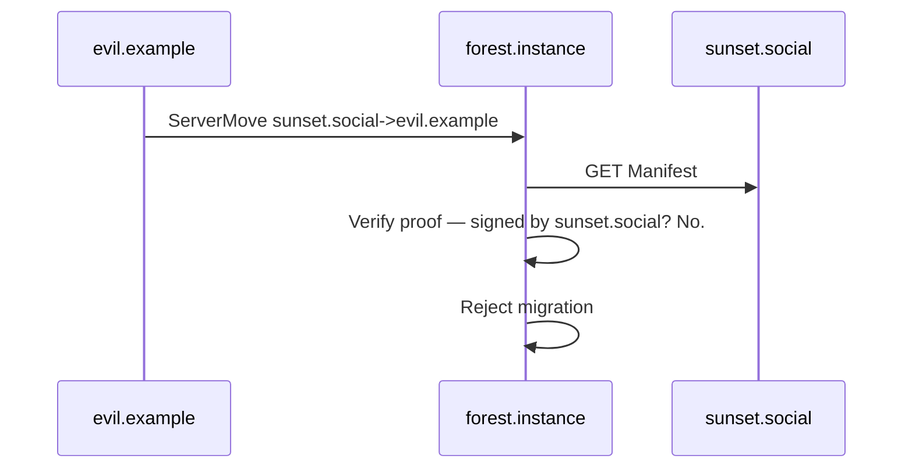
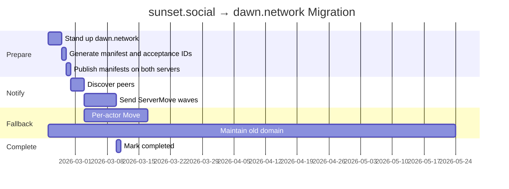

# FEP-a427: Server Domain Migration

## Summary

This FEP defines a best-effort protocol for migrating an entire ActivityPub server from one domain to another when the operator controls both domains and can keep the old domain online.

Example scenario used throughout this document:

- Old server: `sunset.social`
- New server: `dawn.network`
- Remote peer: `forest.instance`

This proposal introduces:

- A **ServerMigration manifest** (a durable migration description object).
- A **ServerMigrationAcceptance** object (destination confirmation).
- A **ServerMove activity** (notification to peers).
- Deterministic **mapping rules** for rewriting identifiers.
- A verification model that prevents identity hijacking.

This FEP is explicitly best-effort. It does not guarantee preservation of all follows across all peers.

### Scope

This FEP addresses **server domain renaming**: one source server migrating to one destination server with a one-to-one mapping of all identifiers. It does not cover merging multiple source servers into a single destination.


## Motivation

### The Core Problem

In practice, ActivityPub identifiers are domain-bound: `https://sunset.social/users/alice`

Remote servers treat that URL as Alice's identity.

If `sunset.social` changes its domain to `dawn.network`, then: `https://dawn.network/users/alice` is treated as a completely different actor unless peers are informed and update their local state.

Current practice requires:

- Emitting `Move` for each actor.
- Hoping remote servers re-follow.
- Maintaining long-lived reverse proxies.

For large instances, this is inefficient and unreliable.

---

## Why Not Just Send "Old Domain → New Domain"?

It might seem sufficient to send:

```
ServerMove { from: sunset.social, to: dawn.network }
```

That is insufficient for three independent reasons.

### 1. Deterministic Rewriting (Why Mapping Exists)

Remote servers need a deterministic algorithm for rewriting identifiers.

If actor paths are preserved:

```
https://sunset.social/users/alice
→ https://dawn.network/users/alice
```

then a rule-based mapping works: replace origin, preserve path.

But if:

- URL structure changed,
- routes differ,

then simple domain substitution fails.

Mapping exists to define precisely how old identifiers derive new identifiers.

Without mapping:

- Peers must guess.
- Guessing causes broken follows and incorrect mentions.
- Full actor lists would need to be published (privacy leak).

---

### 2. Identity Hijacking Prevention (Why Acceptance Exists)

If only one signed message were required, an attacker could send: `ServerMove sunset.social → evil.example`

If peers trusted that blindly, they would rewrite all identifiers and effectively transfer followers to the attacker.

A signature proves who sent the message, not that they control both domains.

Therefore migration requires:

- A statement from `sunset.social`
- A corresponding acceptance from `dawn.network`

Both domains must independently assert the migration.

Only when both sides agree may peers apply changes.

---

### 3. Durability and Idempotency (Why Manifest Exists)

A single notification message is:

- Not cacheable
- Not versioned
- Not lifecycle-aware
- Not retry-safe

Peers require a durable object that:

- Has a stable `id`
- Has a `state`
- Can be fetched repeatedly
- Supports rollback
- Can carry proofs

That durable object is the **ServerMigration manifest**.

---

## Terminology

### ServerMigration (Manifest)

A persistent ActivityStreams object describing:

- Source server (`sunset.social`)
- Destination server (`dawn.network`)
- Mapping rules
- Lifecycle state
- Reference to destination acceptance

It is the canonical description of the migration.

Think of it as: *"The official migration document."*

---

### ServerMigrationAcceptance

A persistent object hosted on the destination server confirming:

- It accepts migration from the source.
- It references the same manifest.

Think of it as: *"We agree to receive these identities."*

---

### ServerMove

A lightweight ActivityPub activity sent to peers that says:

> "Please fetch and apply this migration manifest."

It does not contain full migration details.

---

### Mapping

A deterministic rule that converts old URIs to new URIs. Given the same mapping rules and the same input URI, every implementation MUST produce the same output URI.

Three types exist:

1. **Origin-based mapping**
   Replace origin (scheme + host + port), preserve path.

2. **Prefix-based mapping**
   Replace URI prefixes, preserving remaining path segments.

3. **Regex-based mapping**
   Rewrite URIs using regular expression pattern matching (RE2 semantics).

All mapping rules MUST be reversible: for every old URI that maps to a new URI, it MUST be possible to recover the original old URI from the new URI using the same mapping definition. For `OriginReplace` and `PrefixReplace`, this is satisfied by swapping from/to values. For `RegexReplace`, explicit reverse rules are required.

Mapping prevents guesswork and avoids publishing global user directories.

---

### URI Rewriting Scope

Mapping rules are used to compute new URIs for **actor identifiers** originating from the source server. Peers establish aliases between old and new actor URIs but MUST NOT rewrite non-actor object IDs in place (see [Applying the Migration Locally](#applying-the-migration-locally)).

Non-actor URIs (object IDs, collection URLs, activity IDs, media URLs) are resolved via HTTP redirects served by the source domain, not by rewriting stored values.

---

## Conformance

The key words **MUST**, **SHOULD**, **MAY**, etc. are to be interpreted as described in RFC 2119.

---

## URI Normalization

This specification uses **origin** (scheme + host + port) as defined in [RFC 6454](https://www.rfc-editor.org/rfc/rfc6454) to identify servers. An origin is the tuple `(scheme, host, port)`.

When comparing or matching URIs, implementations MUST apply the following normalization:

1. **Scheme**: lowercase (e.g., `HTTPS` → `https`).
2. **Host**: lowercase, converted to ASCII via punycode for internationalized domain names (IDN) per [RFC 5891](https://www.rfc-editor.org/rfc/rfc5891).
3. **Port**: the default port for the scheme MUST be omitted. For `https`, port `443` is default and MUST NOT appear explicitly. `https://example.com:443/` and `https://example.com/` are the same origin.
4. **Path**: preserved exactly as-is. No normalization of path segments, percent-encoding, or trailing slashes (except that the empty path is equivalent to `/`).

Two URIs are **same-origin** if and only if their normalized origins are identical.

The `fromOrigin` and `toOrigin` values in `OriginReplace` mappings MUST be normalized origins (e.g., `https://sunset.social`, not `https://Sunset.Social:443`).

---

## High-Level Flow



---

## Specification

### 1. Server Actor Discovery

Server actor discovery MUST follow [FEP-d556: Server Actor Discovery](https://codeberg.org/fediverse/fep/src/branch/main/fep/d556/fep-d556.md), which defines a "server" as an origin (scheme + host + port) and specifies how to discover the server-level actor via WebFinger.

The source server, destination server, and all peers MUST expose a server-level actor discoverable via FEP-d556.

Peers MUST discover and use the server actor inbox for `ServerMove` delivery.

---

### 1a. WebFinger Behavior During Migration

During an active or completed migration, the source server's WebFinger responses MUST reflect the migration state so that peers performing fresh lookups discover the canonical identities.

**For actor lookups** (e.g., `?resource=acct:alice@sunset.social`):

During the `active` and `completed` phases, the source server MUST return a WebFinger response that includes an `aliases` array containing the new actor URI:

```json
{
  "subject": "acct:alice@sunset.social",
  "aliases": [
    "https://sunset.social/users/alice",
    "https://dawn.network/users/alice"
  ],
  "links": [
    {
      "rel": "self",
      "type": "application/activity+json",
      "href": "https://dawn.network/users/alice"
    }
  ]
}
```

The `rel="self"` link MUST point to the new canonical actor URI on the destination server. This ensures that peers performing a fresh WebFinger lookup are directed to the new identity even if they have not yet processed the `ServerMove`.

**For server actor lookups** (e.g., `?resource=https://sunset.social/`):

The source server MUST continue to return its own server actor during the `active` phase (the server actor is needed to verify the manifest proof). After the migration is `completed`, the server actor WebFinger response SHOULD include an alias pointing to the new server actor.

---

### 2. ServerMigration Object

A `ServerMigration` object MUST include:

| Property | Type | Description |
|----------|------|-------------|
| `@context` | Array | MUST include `"https://www.w3.org/ns/activitystreams"`, `"https://w3id.org/fep/a427"`, and `"https://w3id.org/security/data-integrity/v1"` |
| `id` | URI | Stable, dereferenceable URI hosted on the source server |
| `type` | String | `"ServerMigration"` |
| `source` | URI | Server actor ID of the source server |
| `target` | URI | Server actor ID of the destination server |
| `mapping` | Object | Mapping rules (see [Mapping Rules](#mapping-rules)) |
| `state` | String | One of: `active`, `completed`, `rolledBack` |
| `published` | `xsd:dateTime` | When the manifest was first published |
| `updated` | `xsd:dateTime` | When the manifest state last changed (MUST be present when `state` is not `active`) |
| `acceptance` | URI | Dereferenceable URL of the `ServerMigrationAcceptance` on the destination server |
| `proof` | Object | FEP-8b32 Object Integrity Proof (see [Cryptographic Proofs](#5-cryptographic-proofs)) |

#### Pre-generating IDs

Because the `ServerMigration` references its `ServerMigrationAcceptance` (via `acceptance`) and the acceptance references the manifest (via `migration`), both IDs MUST be determined before either object is published. Since both objects are controlled by the same operator, the recommended approach is:

1. Generate both IDs deterministically (e.g., based on a shared migration identifier such as a date or UUID).
2. Publish the `ServerMigration` manifest on the source server.
3. Publish the `ServerMigrationAcceptance` on the destination server.

Example ID scheme:

```
ServerMigration:  https://sunset.social/.well-known/server-migration/2026-02-23
Acceptance:       https://dawn.network/.well-known/server-migration-acceptance/2026-02-23
```

#### Full Example

```json
{
  "@context": [
    "https://www.w3.org/ns/activitystreams",
    "https://w3id.org/fep/a427",
    "https://w3id.org/security/data-integrity/v1"
  ],
  "id": "https://sunset.social/.well-known/server-migration/2026-02-23",
  "type": "ServerMigration",
  "source": "https://sunset.social/actor",
  "target": "https://dawn.network/actor",
  "mapping": {
    "type": "OriginReplace",
    "fromOrigin": "https://sunset.social",
    "toOrigin": "https://dawn.network"
  },
  "state": "active",
  "published": "2026-02-23T00:00:00Z",
  "acceptance": "https://dawn.network/.well-known/server-migration-acceptance/2026-02-23",
  "proof": {
    "type": "DataIntegrityProof",
    "cryptosuite": "eddsa-jcs-2022",
    "verificationMethod": "https://sunset.social/actor#ed25519-key",
    "proofPurpose": "assertionMethod",
    "proofValue": "z..."
  }
}
```

---

### 3. ServerMigrationAcceptance Object

Hosted on the destination server (`dawn.network`), MUST include:

| Property | Type | Description |
|----------|------|-------------|
| `@context` | Array | MUST include `"https://www.w3.org/ns/activitystreams"`, `"https://w3id.org/fep/a427"`, and `"https://w3id.org/security/data-integrity/v1"` |
| `id` | URI | Stable, dereferenceable URI hosted on the destination server |
| `type` | String | `"ServerMigrationAcceptance"` |
| `migration` | URI | Reference to the `ServerMigration` manifest |
| `source` | URI | Server actor ID of the source server (MUST match manifest `source`) |
| `target` | URI | Server actor ID of the destination server (MUST match manifest `target`) |
| `proof` | Object | FEP-8b32 Object Integrity Proof signed by the destination server actor |

#### Full Example

```json
{
  "@context": [
    "https://www.w3.org/ns/activitystreams",
    "https://w3id.org/fep/a427",
    "https://w3id.org/security/data-integrity/v1"
  ],
  "id": "https://dawn.network/.well-known/server-migration-acceptance/2026-02-23",
  "type": "ServerMigrationAcceptance",
  "migration": "https://sunset.social/.well-known/server-migration/2026-02-23",
  "source": "https://sunset.social/actor",
  "target": "https://dawn.network/actor",
  "proof": {
    "type": "DataIntegrityProof",
    "cryptosuite": "eddsa-jcs-2022",
    "verificationMethod": "https://dawn.network/actor#ed25519-key",
    "proofPurpose": "assertionMethod",
    "proofValue": "z..."
  }
}
```

---

### 4. ServerMove Activity

A lightweight activity delivered to peers to trigger migration processing.

| Property | Type | Description |
|----------|------|-------------|
| `@context` | Array | MUST include `"https://www.w3.org/ns/activitystreams"` and `"https://w3id.org/fep/a427"` |
| `type` | String | `"ServerMove"` |
| `actor` | URI | Server actor of the source server |
| `object` | URI | URL of the `ServerMigration` manifest |

Example:

```json
{
  "@context": [
    "https://www.w3.org/ns/activitystreams",
    "https://w3id.org/fep/a427"
  ],
  "type": "ServerMove",
  "actor": "https://sunset.social/actor",
  "object": "https://sunset.social/.well-known/server-migration/2026-02-23"
}
```

This MUST be delivered via signed HTTP POST to the peer's server actor inbox.

---

### 5. Cryptographic Proofs

Both `ServerMigration` and `ServerMigrationAcceptance` objects MUST include a `proof` property conforming to [FEP-8b32: Object Integrity Proofs](https://codeberg.org/fediverse/fep/src/branch/main/fep/8b32/fep-8b32.md).

FEP-8b32 proofs are based on the [W3C Data Integrity](https://www.w3.org/TR/vc-data-integrity/) specification and attach a cryptographic signature directly to the object. This ensures authenticity can be verified regardless of how the object was obtained (direct fetch, cache, forwarding).

#### Requirements

- The `ServerMigration` manifest MUST be signed by the source server actor's key.
- The `ServerMigrationAcceptance` MUST be signed by the destination server actor's key.
- Implementations SHOULD support the `eddsa-jcs-2022` cryptosuite. Note that this cryptosuite is not yet finalized; implementations SHOULD be prepared to support additional cryptosuites as they stabilize and SHOULD NOT reject objects solely because they use a different supported cryptosuite.
- Peers MUST verify both proofs before applying any mapping.

#### Verification Method Resolution

Per FEP-8b32, the `verificationMethod` in each proof references a key in a controlled identifier document (typically the actor object). Peers MUST:

1. Fetch the server actor object identified by `source` (or `target` for the acceptance).
2. Verify that the `verificationMethod` URI resolves to a key listed in the actor's `assertionMethod` property (see also [FEP-521a](https://codeberg.org/fediverse/fep/src/branch/main/fep/521a/fep-521a.md)).
3. Verify that the `verificationMethod` is same-origin with the signed document. Cross-origin verification methods MUST be rejected unless the implementation explicitly supports decentralized identifier (DID) based methods.

#### Proof Stability

The `proof` property covers the object at a point in time. When the `state` field changes (e.g., from `active` to `completed`), the source server MUST re-sign the manifest with an updated proof. Peers MUST re-verify the proof each time they fetch the manifest during polling.

The `ServerMove` activity itself is authenticated via HTTP Signatures on the POST request, as is standard for ActivityPub server-to-server delivery.

---

### 6. Fetch Safety

Processing a `ServerMove` requires fetching URLs supplied by a remote party. Without constraints, this creates SSRF (Server-Side Request Forgery) and resource-exhaustion vectors. Implementations MUST enforce the following:

#### Origin Constraints

- All URLs MUST use the `https` scheme. Peers MUST reject `http`, `file`, `ftp`, or any other scheme.
- The `ServerMigration` manifest URL (`ServerMove.object`) MUST be same-origin with `ServerMove.actor`. Peers MUST reject the activity if the manifest URL points to a different origin than the actor.
- The `ServerMigrationAcceptance` URL (`ServerMigration.acceptance`) MUST be same-origin with `ServerMigration.target`. Peers MUST reject the manifest if the acceptance URL points to a different origin than the target server actor.
- When following HTTP redirects during manifest or acceptance fetches, peers MUST verify that the final resolved URL remains same-origin with the expected origin. Cross-origin redirects MUST be rejected.
- Peers MUST NOT fetch URLs that resolve to private or reserved IP address ranges (e.g., `127.0.0.0/8`, `10.0.0.0/8`, `172.16.0.0/12`, `192.168.0.0/16`, `169.254.0.0/16`, `::1`, `fc00::/7`).

#### Resource Limits

- Implementations SHOULD enforce a maximum response body size when fetching migration objects. A limit of 1 MB is RECOMMENDED.
- Implementations SHOULD enforce a fetch timeout. A timeout of 30 seconds per request is RECOMMENDED.
- Implementations SHOULD limit the number of HTTP redirects followed to a maximum of 3.

---

## Receiving Rules

Upon receiving `ServerMove`, a peer:

1. MUST verify the HTTP Signature on the delivery request.
2. MUST fetch the `ServerMigration` manifest from the URL in `object`.
3. MUST verify that `ServerMove.actor` equals `ServerMigration.source`. If they differ, the peer MUST reject the migration.
4. MUST verify the manifest's FEP-8b32 proof by resolving the `verificationMethod` from the source server actor's `assertionMethod` (see [Cryptographic Proofs](#5-cryptographic-proofs)).
5. MUST fetch the `ServerMigrationAcceptance` from the URL in `acceptance`.
6. MUST verify the acceptance's FEP-8b32 proof by resolving the `verificationMethod` from the destination server actor's `assertionMethod`.
7. MUST verify that `acceptance.migration` references the manifest's `id`.
8. MUST verify that `source` and `target` are consistent across both objects.
9. MUST apply the migration locally only if all verification succeeds (see [Applying the Migration Locally](#applying-the-migration-locally)).
10. MUST begin polling the manifest for lifecycle state changes (see [Polling](#polling)).

---

## Mapping Resolution

Mapping rules define how to derive a new URI from an old URI. Mapping is applied only to **actor URIs** (see [Applying the Migration Locally](#applying-the-migration-locally)).



When a `PrefixReplace` or `RegexReplace` mapping contains multiple rules, peers MUST evaluate them in the order they appear in the `rules` array. The **first matching rule** wins. If no rule matches a URI whose origin matches the source server, the URI is left unchanged and the peer SHOULD log a warning for operator review.

Peers MUST treat migration as idempotent per manifest `id`.

---

## Applying the Migration Locally

Peers MUST NOT interpret migration as a naive string-replace across all stored data. A peer's local state includes delivery endpoints, public keys, follow relationships with internal identifiers, moderation decisions, cached objects with provenance information, and historical activities that reference old actor IDs. Blindly rewriting all occurrences would break signature verification on historical objects, corrupt `Undo`/`Accept` semantics (which reference the ID at the time the original activity was created), and bypass blocklists and moderation state.

Instead, peers MUST apply the following model.

### Step 1: Establish Actor Aliases

For each **actor** whose URI origin matches the source server, compute the new URI using the mapping rules. Register the old URI as an **alias** of the new URI:

- The new URI becomes the **canonical identity** used for all future outbound delivery and display.
- The old URI is retained as an alias so that inbound activities, cached objects, and `Undo` operations referencing the old ID continue to resolve correctly.

### Step 2: Fetch and Verify New Actors

For each mapped actor that the peer has a local relationship with (follows, followers, cached profiles), the peer MUST:

1. Fetch the new actor object from the new URI.
2. Verify linkage: the new actor SHOULD include an `alsoKnownAs` property (as an array) containing the old actor URI. If present, this confirms the migration from the actor's perspective.
3. Update locally-stored delivery metadata: `inbox`, `sharedInbox`, `endpoints`, and `publicKey` MUST be replaced with the values from the fetched new actor object.

If the new actor cannot be fetched (network error, 404), the peer SHOULD retain the alias but MUST NOT update delivery metadata. The peer SHOULD retry on subsequent delivery attempts.

### Step 3: Carry Over Moderation State

Block lists, mutes, silences, and other moderation decisions associated with the old actor URI MUST be carried over to the new canonical URI. The old alias MUST also continue to match moderation rules so that references in historical content remain covered.

### Step 4: Non-Actor URIs (Objects, Collections, Media)

Peers MUST NOT rewrite non-actor object IDs (notes, articles, activity IDs, collection URLs, media URLs) in place. Object IDs are treated as identifiers in the ActivityPub data model, not merely as addresses. Rewriting them in place would create:

- Duplicate objects (old ID and new ID both exist in the database).
- Broken thread links (`inReplyTo` chains referencing the old ID would split).
- Mismatched deletes/undos (`Delete` activities reference the original ID).
- Signature mismatches if the `id` in the stored payload differs from the database key.

Instead, non-actor URIs from the source server continue to be stored under their original IDs. When the old domain serves HTTP 301 redirects (see [Old Domain Lifetime](#old-domain-lifetime)), peers that need to re-fetch these objects will be transparently redirected to the new location.

Peers MAY maintain an internal equivalence index (old URI → new URI) for non-actor URIs to optimize lookups, but the stored canonical ID MUST remain the original.

### Step 5: Transfer Follow Relationships

All existing follow relationships involving actors from the source server MUST be automatically transferred to the new canonical URIs:

- If `bob@forest.instance` follows `alice@sunset.social`, after migration `bob` follows `alice@dawn.network`.
- If `alice@sunset.social` follows `carol@forest.instance`, after migration `alice@dawn.network` follows `carol`.

This is an automatic, server-side operation. Individual follow approval policies on the receiving server are not re-triggered — the follow relationship is preserved, not re-established.

### Source Server Requirements

To support the fetch-and-verify step, the source server (or destination server, since they are operated by the same party) SHOULD ensure that each migrated actor on the new domain includes an `alsoKnownAs` property referencing the old URI as an array:

```json
{
  "id": "https://dawn.network/users/alice",
  "type": "Person",
  "alsoKnownAs": ["https://sunset.social/users/alice"],
  "inbox": "https://dawn.network/users/alice/inbox",
  "publicKey": { "..." }
}
```

This provides per-actor verification that complements the server-level manifest proofs.

---

## Actor Opt-Out

Individual actors cannot opt out of a server migration. Domain migration is an operational decision made by the server operator and applies to all actors hosted on that server. This is analogous to other server-wide operational changes (TLS certificate rotation, IP address changes) that do not require per-actor consent.

Actors who disagree with the migration may independently move to a different server using per-actor `Move` after the migration completes.

---

## Polling

After applying a migration, peers MUST periodically poll the `ServerMigration` manifest to track lifecycle state changes.

### Polling Strategy

Peers SHOULD use the following polling schedule:

| Time Since Migration Applied | Poll Interval |
|------------------------------|---------------|
| First 24 hours | Every 1 hour |
| Days 2–7 | Every 6 hours |
| Days 8–30 | Every 24 hours |
| After 30 days | Every 7 days |

Peers MUST continue polling until the manifest state changes to `completed` or `rolledBack`.

### On State Change to `completed`

The peer marks the migration as finalized. No further polling is needed for this manifest.

### On State Change to `rolledBack`

The peer MUST reverse the migration by restoring old actor aliases as canonical and demoting the new URIs. Since actors were migrated using the alias model (Step 1), the old URI is still stored. No mapping rule inversion is needed for actor URIs.

The peer MUST re-fetch actor objects from the original (source) server to restore delivery metadata (inbox, keys).

Since non-actor URIs were never rewritten (Step 4), no reversal is needed for object IDs, collection URLs, or media URLs.

However, if an individual actor performed a per-actor `Move` activity during the `active` phase (i.e., the actor independently moved to a different server while the server-wide migration was in progress), that per-actor `Move` takes precedence. The server-wide rollback MUST NOT override an actor's intentional individual move. Peers SHOULD check whether each actor has a more recent per-actor `Move` on record before reversing the alias.

After processing a rollback, the peer MUST mark this migration ID as **permanently invalid**. If a `ServerMove` referencing this same manifest `id` is received again in the future, the peer MUST reject it.

### On Fetch Failure

If a poll request fails (network error, HTTP 5xx), the peer SHOULD retry using exponential backoff starting at 1 hour, capped at 24 hours.

If the manifest becomes permanently unreachable (HTTP 404 or 410 for 7 consecutive days), the peer SHOULD stop polling. However, the peer MUST NOT infer `completed` from unreachability alone. The migration remains in whatever state was last observed and verified. The peer SHOULD log a warning so operators can investigate.

---

## Lifecycle



`RolledBack` and `Completed` are terminal states. A rolled-back migration cannot be reactivated. If the operator wishes to attempt the migration again, a new `ServerMigration` manifest with a new `id` MUST be created.

### Grace Period

Once a migration reaches the `completed` state, it MUST NOT be changed to `rolledBack`. Rollback is only available from the `active` state. This prevents long-term state instability where peers that already finalized the migration would need to reverse months-old changes.

Operators who need to reverse a completed migration MUST treat it as a new migration in the opposite direction (from `dawn.network` back to `sunset.social`), using a new manifest.

### Per-Actor Move Precedence

Per-actor `Move` activities always take precedence over server-wide migration state. If an individual actor performed a `Move` to a third-party server while the server-wide migration was `active`, that actor's individual move MUST NOT be overridden by a subsequent server-wide rollback. Peers SHOULD track per-actor moves independently of server-wide migrations.

Peers MUST:

- Respect `rolledBack` by restoring actor aliases (except where per-actor `Move` takes precedence).
- Avoid duplicate processing (track applied migration IDs).
- Permanently reject reuse of a rolled-back manifest ID.

---

## Migration History

Servers MUST retain all `ServerMigration` manifests indefinitely, regardless of their terminal state. This allows peers that were offline during the migration window to discover and process migrations after the fact.

Both the source and destination servers SHOULD serve the manifest at its original URL. The destination server SHOULD additionally serve a copy of the manifest so that peers can discover it even if the source domain eventually becomes unavailable.

### Conflicting Migrations

A source server MUST NOT have more than one migration in the `active` state at any time. If a peer receives a `ServerMove` for a source server that already has an active migration with a different manifest `id`, the peer MUST reject the new migration and SHOULD log a warning.

Once a migration reaches a terminal state (`completed` or `rolledBack`), a new migration from the same source server is permitted.

### Chained Migrations

If a server migrates from A to B (completed), and later from B to C, peers that processed the first migration will encounter the second migration naturally. Peers that missed the first migration and later discover A→B (completed) and B→C (active or completed) SHOULD apply both in sequence.

---

## Security Considerations

Migration requires two-party agreement.



A migration is valid only if:

- The `ServerMigration` manifest is signed by `sunset.social`'s server actor key (FEP-8b32 proof).
- The `ServerMigrationAcceptance` is signed by `dawn.network`'s server actor key (FEP-8b32 proof).
- Both objects reference each other.
- `ServerMove.actor` matches `ServerMigration.source`.

Without both proofs, identity hijacking is prevented.

### SSRF and Resource Exhaustion

Because peers fetch URLs supplied by remote parties, implementations MUST enforce the origin constraints and resource limits defined in [Fetch Safety](#6-fetch-safety). In particular:

- Same-origin checks prevent an attacker from directing peers to fetch internal network resources (`http://127.0.0.1`, `http://169.254.169.254`, internal admin panels).
- HTTPS-only enforcement prevents downgrade attacks and plaintext interception.
- Body size and timeout limits prevent tarpit-style denial of service (e.g., a server that streams an infinite response).

### Domain Takeover After Migration

If the source domain (`sunset.social`) expires after migration and is re-registered by a different party, the new registrant could stand up a server actor with new keys and attempt to publish a fraudulent `ServerMigration` manifest.

To mitigate this risk:

- Peers SHOULD only accept a `ServerMove` if they have **previously cached** the source server actor's public key (key continuity). A `ServerMove` from an origin whose server actor key has never been seen before SHOULD be treated as suspicious and MAY be rejected or flagged for manual review.
- Peers SHOULD reject migrations where the manifest's `published` timestamp is significantly later than the last known activity from that origin (e.g., more than 90 days after the last seen interaction). This heuristic helps detect stale-domain takeover attempts.
- Operators SHOULD maintain control of the old domain for as long as feasible. Allowing a domain to expire after migration creates a permanent risk.
- For stronger key continuity guarantees, server actors MAY use decentralized identifier (DID) based `verificationMethod` values, which are not tied to domain ownership. This is compatible with FEP-8b32's controlled identifier model but is not required by this specification.

---

## Privacy Considerations

- Rule-based mapping avoids publishing user lists.
- Explicit actor lists are not used in this protocol.
- Follow relationships are automatically transferred; no re-follow is required, and no follow requests are publicly visible during migration.

---

## Fallback

If `forest.instance` does not support this FEP:

- `sunset.social` SHOULD emit per-actor `Move` activities for each actor.
- `sunset.social` SHOULD keep old domain operational.
- Old actor URLs SHOULD continue resolving (via redirects or proxying).

---

## Old Domain Lifetime

This FEP does not mandate a specific duration for maintaining the old domain. However, the following recommendations apply:

- The source server SHOULD keep the old domain operational for at least 90 days after marking the migration as `completed`.
- During this period, the old domain SHOULD serve HTTP 301 redirects to corresponding new-domain URIs for all actor and object URLs.
- The `ServerMigration` manifest SHOULD remain fetchable on the old domain indefinitely (or as long as feasible).
- The destination server SHOULD also serve a copy of the manifest to ensure discoverability if the old domain eventually goes offline.

Operators should be aware that some peers may be offline for extended periods. The longer the old domain remains operational, the more peers will successfully process the migration.

### Old URI Resolution (Tombstones vs Redirects)

When the old domain is still operational, old URIs SHOULD be handled as HTTP 301 (Moved Permanently) redirects to the corresponding new URIs. This is preferred over returning `Tombstone` objects because:

- 301 redirects work transparently with HTTP clients that do not understand ActivityPub semantics.
- They support the fallback scenario where peers have not processed the `ServerMove`.
- They enable gradual, passive migration for peers that discover the new location through normal fetching.
- Since peers do not rewrite non-actor object IDs (Step 4), 301 redirects are the primary mechanism for resolving old object URIs to new locations.

`Tombstone` objects SHOULD NOT be used for migrated resources because they signal deletion, which may cause peers to remove cached content rather than update references.

The source server SHOULD return the manifest itself (not a redirect) at its `.well-known` URL, so that peers can always fetch it for verification.

---

## Deployment Phases



---

## Mapping Rules

Scenario used in examples:

- Source server: `sunset.social` (origin: `https://sunset.social`)
- Destination server: `dawn.network` (origin: `https://dawn.network`)

---

### 1. Simple Origin-Based Mapping

#### Use Case

URL structure remains identical. Only the origin (scheme + host) changes.

#### Rule Definition (Conceptual)

```
If URI origin equals "https://sunset.social"
Replace origin with "https://dawn.network"
Preserve path
```

#### Example Transformations

```
https://sunset.social/users/alice
→ https://dawn.network/users/alice

https://sunset.social/@bob
→ https://dawn.network/@bob

https://sunset.social/groups/astronomy
→ https://dawn.network/groups/astronomy

https://sunset.social/notes/12345
→ https://dawn.network/notes/12345
```

#### Manifest Example

```json
{
  "type": "ServerMigration",
  "mapping": {
    "type": "OriginReplace",
    "fromOrigin": "https://sunset.social",
    "toOrigin": "https://dawn.network"
  }
}
```

---

### 2. Prefix-Based Mapping (Path Changes)

#### Use Case

Old server used `/users/`
New server uses `/profile/`

#### Transformations

```
https://sunset.social/users/alice
→ https://dawn.network/profile/alice
```

#### Rule Definition

```
Match prefix: https://sunset.social/users/
Rewrite to: https://dawn.network/profile/
Append remaining path segment
```

#### Manifest Example

```json
{
  "mapping": {
    "type": "PrefixReplace",
    "rules": [
      {
        "fromPrefix": "https://sunset.social/users/",
        "toPrefix": "https://dawn.network/profile/"
      }
    ]
  }
}
```

Deterministic. Still does not expose actor lists.

---

### 3. Multiple Actor Types (Users + Groups)

#### Use Case

Users and groups have different routes.

```
https://sunset.social/users/alice
→ https://dawn.network/u/alice

https://sunset.social/groups/astronomy
→ https://dawn.network/g/astronomy
```

#### Manifest Example

```json
{
  "mapping": {
    "type": "PrefixReplace",
    "rules": [
      {
        "fromPrefix": "https://sunset.social/users/",
        "toPrefix": "https://dawn.network/u/"
      },
      {
        "fromPrefix": "https://sunset.social/groups/",
        "toPrefix": "https://dawn.network/g/"
      }
    ]
  }
}
```

Rules are evaluated in order. The first matching rule is applied.

---

### 4. Catch-All with Prefix Rules

When using `PrefixReplace`, it is RECOMMENDED to include a catch-all rule as the last entry to handle URIs that don't match specific prefix patterns:

```json
{
  "mapping": {
    "type": "PrefixReplace",
    "rules": [
      {
        "fromPrefix": "https://sunset.social/users/",
        "toPrefix": "https://dawn.network/u/"
      },
      {
        "fromPrefix": "https://sunset.social/groups/",
        "toPrefix": "https://dawn.network/g/"
      },
      {
        "fromPrefix": "https://sunset.social/",
        "toPrefix": "https://dawn.network/"
      }
    ]
  }
}
```

---

### 5. Regex-Based Mapping

#### Use Case

URL structure changed in ways that cannot be expressed with simple prefix substitution:

```
https://sunset.social/@alice
→ https://dawn.network/users/alice
```

#### Manifest Example

```json
{
  "mapping": {
    "type": "RegexReplace",
    "rules": [
      {
        "pattern": "^https://sunset\\.social/@([^/]+)$",
        "replacement": "https://dawn.network/users/$1"
      },
      {
        "pattern": "^https://sunset\\.social/(.*)$",
        "replacement": "https://dawn.network/$1"
      }
    ]
  }
}
```

Rules are evaluated in order. The first matching rule is applied.

#### Safety Requirements

Regex-based mapping is powerful but carries implementation risks. Peers processing `RegexReplace` mappings:

- MUST use a regex engine that guarantees linear-time matching (e.g., RE2 semantics). Backtracking engines are vulnerable to ReDoS (Regular Expression Denial of Service) attacks via crafted patterns.
- MUST reject patterns that exceed 256 characters in length.
- MUST enforce a per-match timeout of no more than 10 milliseconds.
- MUST validate that the replacement result is a valid HTTPS URI with an origin matching the `target` server. Any result that does not match MUST be discarded and the URI left unchanged.
- SHOULD log a warning if a pattern fails to compile or produces an invalid result.

Implementations that cannot guarantee linear-time regex matching SHOULD reject `RegexReplace` mappings and treat the `ServerMove` as unsupported, falling back to per-actor `Move` processing.

---

## Vocabulary

This FEP defines the following terms under the namespace `https://w3id.org/fep/a427#`:

### Types

| Term | URI | Description |
|------|-----|-------------|
| `ServerMigration` | `https://w3id.org/fep/a427#ServerMigration` | A durable manifest describing a server domain migration |
| `ServerMigrationAcceptance` | `https://w3id.org/fep/a427#ServerMigrationAcceptance` | Confirmation from the destination server accepting the migration |
| `ServerMove` | `https://w3id.org/fep/a427#ServerMove` | Activity notifying peers to process a migration |
| `OriginReplace` | `https://w3id.org/fep/a427#OriginReplace` | Mapping type: replace URI origin, preserve path |
| `PrefixReplace` | `https://w3id.org/fep/a427#PrefixReplace` | Mapping type: replace URI prefixes |
| `RegexReplace` | `https://w3id.org/fep/a427#RegexReplace` | Mapping type: regex-based URI rewriting (RE2 semantics required) |

### Properties

| Term | URI | Domain | Range | Description |
|------|-----|--------|-------|-------------|
| `source` | `https://w3id.org/fep/a427#source` | `ServerMigration`, `ServerMigrationAcceptance` | URI | Server actor of the source server |
| `target` | `https://w3id.org/fep/a427#target` | `ServerMigration`, `ServerMigrationAcceptance` | URI | Server actor of the destination server |
| `mapping` | `https://w3id.org/fep/a427#mapping` | `ServerMigration` | Object | Mapping rules for URI rewriting |
| `state` | `https://w3id.org/fep/a427#state` | `ServerMigration` | String | Lifecycle state: `active`, `completed`, `rolledBack` |
| `acceptance` | `https://w3id.org/fep/a427#acceptance` | `ServerMigration` | URI | Reference to the `ServerMigrationAcceptance` |
| `migration` | `https://w3id.org/fep/a427#migration` | `ServerMigrationAcceptance` | URI | Reference to the `ServerMigration` manifest |
| `fromOrigin` | `https://w3id.org/fep/a427#fromOrigin` | `OriginReplace` | String | Normalized source origin (scheme + host + port) |
| `toOrigin` | `https://w3id.org/fep/a427#toOrigin` | `OriginReplace` | String | Normalized destination origin |
| `rules` | `https://w3id.org/fep/a427#rules` | `PrefixReplace`, `RegexReplace` | Array | Ordered list of replacement rules |
| `fromPrefix` | `https://w3id.org/fep/a427#fromPrefix` | Prefix rule object | String | URI prefix to match |
| `toPrefix` | `https://w3id.org/fep/a427#toPrefix` | Prefix rule object | String | Replacement URI prefix |
| `pattern` | `https://w3id.org/fep/a427#pattern` | Regex rule object | String | RE2-compatible regex pattern |
| `replacement` | `https://w3id.org/fep/a427#replacement` | Regex rule object | String | Replacement string with capture group references |

Note: This specification uses `published` and `updated` from the ActivityStreams 2.0 vocabulary (`https://www.w3.org/ns/activitystreams#published`, `https://www.w3.org/ns/activitystreams#updated`) rather than defining custom date-time properties.

### JSON-LD Context

The associated [context document](./context.jsonld) at `https://w3id.org/fep/a427` defines the term mappings:

```json
{
  "@context": {
    "fep-a427": "https://w3id.org/fep/a427#",
    "ServerMigration": "fep-a427:ServerMigration",
    "ServerMigrationAcceptance": "fep-a427:ServerMigrationAcceptance",
    "ServerMove": "fep-a427:ServerMove",
    "OriginReplace": "fep-a427:OriginReplace",
    "PrefixReplace": "fep-a427:PrefixReplace",
    "RegexReplace": "fep-a427:RegexReplace",
    "source": { "@id": "fep-a427:source", "@type": "@id" },
    "target": { "@id": "fep-a427:target", "@type": "@id" },
    "mapping": "fep-a427:mapping",
    "state": "fep-a427:state",
    "acceptance": { "@id": "fep-a427:acceptance", "@type": "@id" },
    "migration": { "@id": "fep-a427:migration", "@type": "@id" },
    "fromOrigin": "fep-a427:fromOrigin",
    "toOrigin": "fep-a427:toOrigin",
    "rules": { "@id": "fep-a427:rules", "@container": "@list" },
    "fromPrefix": "fep-a427:fromPrefix",
    "toPrefix": "fep-a427:toPrefix",
    "pattern": "fep-a427:pattern",
    "replacement": "fep-a427:replacement"
  }
}
```

---

## Relationship to Existing Work

This FEP:

- Complements per-actor `Move` (used as fallback for non-supporting peers).
- Relies on [FEP-8b32](https://codeberg.org/fediverse/fep/src/branch/main/fep/8b32/fep-8b32.md) for Object Integrity Proofs.
- Relies on [FEP-d556](https://codeberg.org/fediverse/fep/src/branch/main/fep/d556/fep-d556.md) for server actor discovery.
- Is compatible with [FEP-521a](https://codeberg.org/fediverse/fep/src/branch/main/fep/521a/fep-521a.md) for verification method resolution.
- Does not replace WebFinger.
- Does not define content portability.
- Provides a scalable alternative to N-per-actor migration.

---

## Final Notes

Server-wide domain migration is inherently messy because identifiers are authority-bound.

This FEP does not attempt to make migration perfect.

It attempts to make it:

- Verifiable
- Deterministic
- Idempotent
- Resistant to identity hijacking
- Operationally feasible at scale.

## Copyright

CC0 1.0 Universal (CC0 1.0) Public Domain Dedication

To the extent possible under law, the authors of this Fediverse Enhancement Proposal have waived all copyright and related or neighboring rights to this work.

