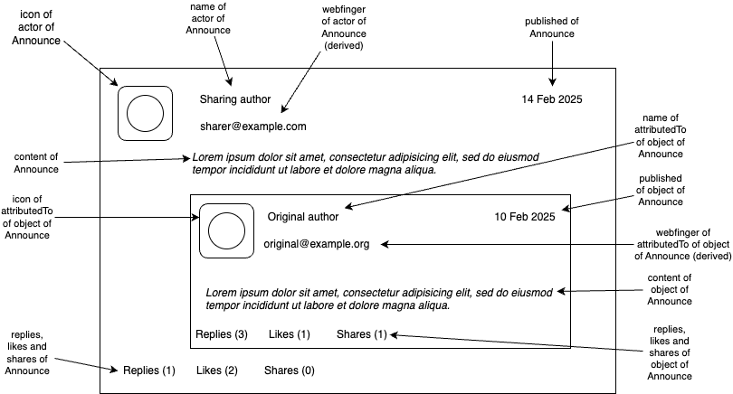

# FEP-dd4b: Quote Posts

## Summary

This FEP describes the mechanism defined in [Activity Streams 2.0][AS2] and the [Activity Vocabulary][Vocabulary] for making quote posts, that is, [Announce](https://www.w3.org/TR/activitystreams-vocabulary/#dfn-announce) activities with additional commentary.

## Motivation

Redistributing content or activities created by other actors is a key activity on the social web. The [Announce](https://www.w3.org/TR/activitystreams-vocabulary/#dfn-announce) activity type is defined in Activity Streams 2.0 ("AS2") to represent this activity. `Announce` is used in ActivityPub to provide sharing functionality; see [7.11 Announce Activity (sharing)](https://www.w3.org/TR/activitypub/#announce-activity-inbox).

The [Activity](https://www.w3.org/TR/activitystreams-vocabulary/#dfn-activity) object type in AS2 inherits all the properties of the [Object](https://www.w3.org/TR/activitystreams-vocabulary/#dfn-activity) type. This means that **all** activity types have a rich set of properties for representation as first-class content on the social web. The `Announce` type is no exception.

However, the ActivityPub specification does not describe how to use those properties to provide additional commentary, metadata, and files for the shared content. Called ["quote Tweets"](https://en.wikipedia.org/wiki/Tweet_(social_media)#Quote_tweets), "repost with comment", or ["quote posts"](https://help.instagram.com/279780184399513), this kind of extended sharing gives additional context to shared objects.

This FEP describes how to use the `content` property to provide this commentary, as well as other properties that may be useful in this context. It is applicable to uses of Activity Streams 2.0 in general; where it applies to ActivityPub, it is noted.

## Specification

- The `object` property of an `Announce` activity MUST be a reference to the shared content. It MAY be an AS2 `Object` or a `Link`, either as a JSON object or as a URL.
- The `content` property of an `Announce` activity MAY be used to provide additional commentary on the shared content.
- The `attachment` property of an `Announce` activity MAY be used to provide additional media content related to the shared content or the commentary.
- The `tag` property of an `Announce` activity MAY be used to provide additional metadata, such as [Mention](https://www.w3.org/TR/activitystreams-vocabulary/#dfn-mention) objects or [Hashtag][Miscellany] objects, about the shared content or the commentary.
- The `inReplyTo` property of an `Announce` activity MAY be used to connect an `Announce` activity to another object as a reply. The replied-to object MAY be the shared content, but this is unusual; it MAY also be part of a separate conversation.
- An `Announce` activity with an `inReplyTo` property SHOULD be included in the `replies` collection of the object being replied to.
- `Announce` activities SHOULD be counted as part of the `shares` collection of the shared content, regardless of any additional properties, as defined in [7.11 Announce Activity (sharing)](https://www.w3.org/TR/activitypub/#announce-activity-inbox).

## Examples

### Basic Quote Post

This represents a simple quote post, where the actor is sharing a note from another actor with commentary.

```json
{
  "@context": "https://www.w3.org/ns/activitystreams",
  "id": "https://example.com/activities/aaabbbccc",
  "type": "Announce",
  "actor": "https://example.com/users/evan",
  "to": "https://example.com/users/evan/followers",
  "object": {
    "id": "https://example.com/notes/1234",
    "type": "Note",
    "attributedTo": "https://example.com/users/franklin"
  },
  "content": "I think that this is a good point and should be shared."
}
```

### Quote Post with Attachment

This represents a quote post with an attachment, where the actor is sharing a note from another actor with commentary and an image.

```json
{
  "@context": "https://www.w3.org/ns/activitystreams",
  "id": "https://example.com/activities/dddeeefff",
  "type": "Announce",
  "actor": "https://example.com/users/evan",
  "to": "https://example.com/users/evan/followers",
  "object": {
    "id": "https://example.com/notes/1234",
    "type": "Note",
    "attributedTo": "https://example.com/users/franklin"
  },
  "content": "The author describes the rock formations of Crete; here's an example from my recent visit.",
  "attachment": {
    "type": "Link",
    "mediaType": "image/jpeg",
    "url": "https://example.com/images/1234.jpg"
  }
}
```

### Quote Post with Hashtag

This represents a quote post with a hashtag, where the actor is sharing a note from another actor with commentary and a hashtag.

```json
{
  "@context": "https://www.w3.org/ns/activitystreams",
  "id": "https://example.com/activities/ghhiijjkk",
  "type": "Announce",
  "actor": "https://example.com/users/evan",
  "to": "https://example.com/users/evan/followers",
  "object": {
    "id": "https://example.com/notes/1234",
    "type": "Note",
    "attributedTo": "https://example.com/users/franklin"
  },
  "content": "Great description of Cretan geology; saving it for my next trip. <a href='https://example.com/tags/evanstriptocrete'>#evanstriptocrete</a>",
  "tag": {
    "type": "Hashtag",
    "href": "https://example.com/tags/evanstriptocrete",
    "name": "evanstriptocrete"
  }
}
```

### Quote Post with Mention

This represents a quote post with a mention, where the actor is sharing a note from another actor with commentary and a mention.

```json
{
  "@context": "https://www.w3.org/ns/activitystreams",
  "id": "https://example.com/activities/lllmmnnoo",
  "type": "Announce",
  "actor": "https://example.com/users/evan",
  "to": ["https://example.com/users/evan/followers", "https://example.com/users/jeff"],
  "object": {
    "id": "https://example.com/notes/1234",
    "type": "Note",
    "attributedTo": "https://example.com/users/franklin"
  },
  "content": "<a href='https://example.com/users/jeff'>@jeff</a> you might like this Cretan geology article.",
  "tag": {
    "type": "Mention",
    "href": "https://example.com/users/jeff",
    "name": "jeff"
  }
}
```

The author of the quoted material can also be mentioned.


```json
{
  "@context": "https://www.w3.org/ns/activitystreams",
  "id": "https://example.com/activities/pppqqqrrr",
  "type": "Announce",
  "actor": "https://example.com/users/evan",
  "to": ["https://example.com/users/evan/followers", "https://example.com/users/franklin"],
  "object": {
    "id": "https://example.com/notes/1234",
    "type": "Note",
    "attributedTo": "https://example.com/users/franklin"
  },
  "content": "<a href='https://example.com/users/franklin'>@franklin</a> wrote this great Cretan geology article.",
  "tag": {
    "type": "Mention",
    "href": "https://example.com/users/franklin",
    "name": "franklin"
  }
}
```

### Quote Post as Reply

A quote post can be used as a reply, often to share evidence or information from another source.

```json
{
  "@context": "https://www.w3.org/ns/activitystreams",
  "id": "https://example.com/activities/rrrsssttt",
  "type": "Note",
  "actor": "https://example.com/users/jeff",
  "to": "https://example.com/users/jeff/followers",
  "content": "Does anyone know where I can find a good article on Cretan geology?",
  "replies": {
    "id": "https://example.com/activities/rrrsssttt/replies",
    "type": "Collection",
    "totalItems": 1,
    "items": [
      {
        "id": "https://example.com/activities/lllmmnnoo",
        "type": "Announce",
        "actor": "https://example.com/users/evan",
        "object": {
          "id": "https://example.com/notes/1234",
          "type": "Note",
          "attributedTo": "https://example.com/users/franklin"
        },
        "content": "<a href='https://example.com/users/jeff'>@jeff</a> you might like this Cretan geology article.",
        "tag": {
          "type": "Mention",
          "href": "https://example.com/users/jeff",
          "name": "jeff"
        },
        "inReplyTo": "https://example.com/activities/rrrsssttt"
      }
    ]
  }
}
```

## User interface guidance

A common representation of quote posts is to include the `object` of the `Announce` as an embedded card or other representation, with the `content` of the `Announce` object as introductory text.



## Security considerations

For all `Announce` activities, it's important to consider how much of the shared content to expose to the recipient of the `Announce` activity. Using an URL as a reference, or including a limited set of metadata as in the examples in this FEP, allows the publishing server for the shared content to control access to the content. See [Inclusion of the shared object](https://www.w3.org/wiki/ActivityPub/Primer/Announce_activity#Inclusion_of_the_shared_object) in the [ActivityPub Primer][Primer] for more information.

## References

- James Snell, Evan Prodromou, et al. [Activity Streams 2.0][AS2]. W3C Recommendation. 8 May 2018.
- James Snell, Evan Prodromou, et al. [Activity Streams Vocabulary][Vocabulary]. W3C Recommendation. 8 May 2018.
- Christine Lemmer-Webber, Jessica Tallon, et al. [ActivityPub][ActivityPub]. W3C Recommendation. 23 January 2018.
- Evan Prodromou. [ActivityPub Miscellaneous Terms][Miscellany]. W3C Social Web Community Group Draft Report. 3 October 2024.
- W3C members and contributors. [ActivityPub Primer][Primer]. W3C Wiki. 2023 and later.

[ActivityPub]: https://www.w3.org/TR/activitypub/
[AS2]: https://www.w3.org/TR/activitystreams-core/
[Vocabulary]: https://www.w3.org/TR/activitystreams-vocabulary/
[Miscellany]: https://swicg.github.io/miscellany/
[Primer]: https://www.w3.org/wiki/ActivityPub/Primer

## Copyright

CC0 1.0 Universal (CC0 1.0) Public Domain Dedication

To the extent possible under law, the authors of this Fediverse Enhancement Proposal have waived all copyright and related or neighboring rights to this work.
